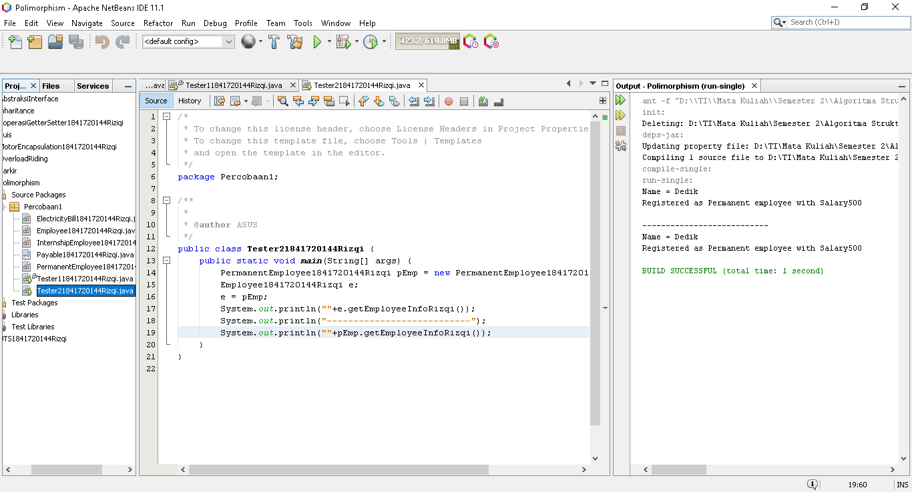
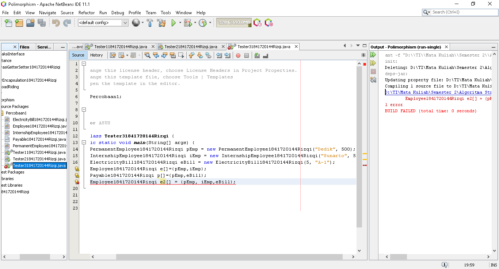
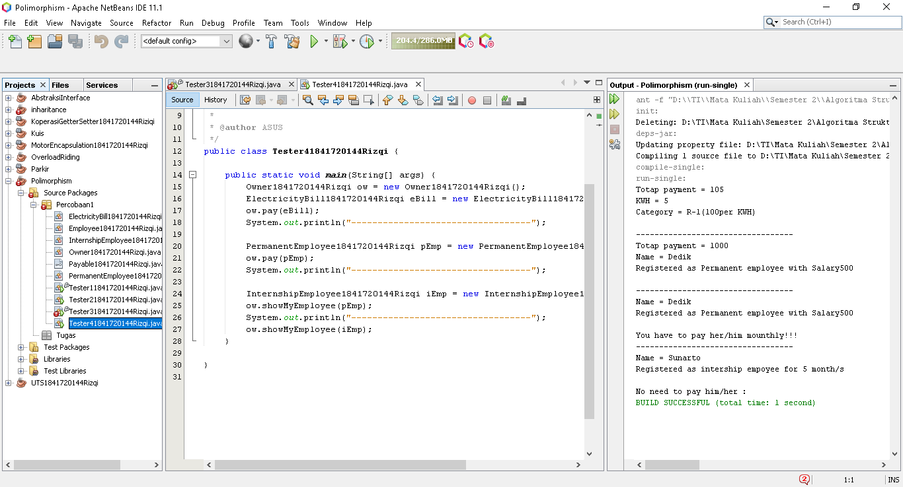

# Laporan Praktikum #10 - POLIMORFISME
## Kompetensi
Setelah melakukan percobaan pada jobsheet ini, diharapkan mahasiswa
mampu:
* Memahami konsep dan bentuk dasar polimorfisme.
* Memahami konsep virtual method invication.
* Menerapkan polimorfisme pada pembuatan heterogeneous collection.
* Menerapkan polimorfisme pada parameter/argument method.
* Menerapkan object casting untuk meng-ubah bentuk objek.
***
## Ringkasan Materi
* Virtual method Invocation
* Heterogeneous Collection
* Polymorphic Argument
* Operator instanceof
* Object Casting
***
## PERCOBAAN
### PERCOBAAN 1 - Abstract Class
  
>
>  
>[Kode program Percobaan 1 Employee1841720144Rizqi.java](../../src/10_Polimorfisme/Percobaan1/Employee1841720144Rizqi.java)  
>
>[Kode program Percobaan 1 Payable1841720144Rizqi.java](../../src/10_Polimorfisme/Percobaan1/Payable1841720144Rizqi.java)  
>
>[Kode program Percobaan 1 InternshipEmployee1841720144Rizqi.java](../../src/10_Polimorfisme/Percobaan1/InternshipEmployee1841720144Rizqi.java)  
>
>[Kode program Percobaan 1 PermanentEmployee1841720144Rizqi.java](../../src/10_Polimorfisme/Percobaan1/PermanentEmployee1841720144Rizqi.java)  
>
>[Kode program Percobaan 1 ElectricityBill1841720144Rizqi.java](../../src/10_Polimorfisme/Percobaan1/ElectricityBill1841720144Rizqi.java)  
>
>[Kode program Percobaan 1 Tester11841720144Rizqi.java](../../src/10_Polimorfisme/Percobaan1/Tester11841720144Rizqi.java)  
>
### Pertanyaan
1. Class apa sajakah yang merupakan turunan dari class Employee?  
`Jawab`  
>Class PermanentEmployee dan InternshipEmployee.
2. Class apa sajakah yang implements ke interface Payable?  
`Jawab`  
>Class PermanentEmployee dan ElectricityBill.
3. Perhatikan class Tester1, baris ke-10 dan 11. Mengapa e, bisa diisi dengan objek pEmp (merupakan objek dari class PermanentEmployee) dan objek iEmp (merupakan objek dari class InternshipEmploye) ?  
`Jawab`  
>Karena class InternshipEmployee dan PermanentEmployee merupakan sub-class dari Class Employee.
4. Perhatikan class Tester1, baris ke-12 dan 13. Mengapa p, bisa diisi dengan objek pEmp (merupakan objek dari class PermanentEmployee) dan objek eBill (merupakan objek dari class ElectricityBill) ?  
`Jawab`  
>Karena Class PermanentEmployee dan ElectricityBill merupakan implementasi dari class Payable.
5. Coba tambahkan sintaks:
* p = iEmp;
* e = eBill;  
`Jawab`  
>* Karena Class Payable dengan InternshipEmployee tidak ada hubungannuya 
>* Class Employee juga tidak terhubung dengan ElectricityBill.
6. Ambil kesimpulan tentang konsep/bentuk dasar polimorfisme!  
`Jawab`  
>ketika ada suatu objek yang dideklarasikan dari
super class, maka objek tersebut bisa diinstansiasi sebagai objek dari sub
class

***
### PERCOBAAN 2 - Virtual method invocation
>  
>[Kode program Percobaan 2 Tester21841720144Rizqi.java](../../src/10_Polimorfisme/Percobaan1/Tester21841720144Rizqi.java)
### Pertanyaan
1. Perhatikan class Tester2 di atas, mengapa pemanggilan e.getEmployeeInfo() pada baris 8 dan pEmp.getEmployeeInfo() pada baris 10 menghasilkan hasil sama?  
`Jawab`  
>Karena e = pEmp; dimana e mereferensikan Class Employee dan pEmp mereferensikan PermanentEmployee.
dan e deireferensikan ke pEmp.
2. Mengapa pemanggilan method e.getEmployeeInfo() disebut sebagai pemanggilan method virtual (virtual method invication), sedangkan pEmp.getEmployeeInfo() tidak?  
`Jawab`  
>Karena method e.getEmployeeInfo() saat dijalankan akan menjalankan method getEmployeeInfo() yang ada pada class PermanentEmployee terjadi karena ada pemanggilan overriding method dari suatu objek polimorfisme.  
3. Jadi apakah yang dimaksud dari virtual method invocation? Mengapa
disebut virtual?  
`Jawab`  
>Virtual method invocation terjadi ketika ada pemanggilan overriding method
dari suatu objek polimorfisme. Disebut virtual karena antara method yang
dikenali oleh compiler dan method yang dijalankan oleh JVM berbeda.
***
### PERCOBAAN 3 - Heterogenous Collection

>  
>[Kode program Percobaan 3 Tester31841720144Rizqi.java](../../src/10_Polimorfisme/Percobaan1/Tester31841720144Rizqi.java)
### Pertanyaan 
1. Perhatikan array e pada baris ke-8, mengapa ia bisa diisi dengan objek-objek dengan tipe yang berbeda, yaitu objek pEmp (objek dari PermanentEmployee) dan objek iEmp (objek dari InternshipEmployee) ?  
`Jawab`  
>Karena Class PermanentEmployee dan InternshipEmployee merupakan Sub-class dari Class Employee.
2. Perhatikan juga baris ke-9, mengapa array p juga biisi dengan objekobjek dengan tipe yang berbeda, yaitu objek pEmp (objek dari PermanentEmployee) dan objek eBill (objek dari ElectricityBilling) ?  
`Jawab`  
>Karena Class PermanentEmployee dan ElectricityBill Implementasi dari Class Payable.
3. Perhatikan baris ke-10, mengapa terjadi error?  
`Jawab`  
>Karena eBill tidak mempunyai hubungan dengan Class Employee.
***
### Percobaan 4 - Argumen polimorfisme, instanceod dan casting objek
>  
>[Kode program Percobaan 4 Owner1841720144Rizqi.java](../../src/10_Polimorfisme/Percobaan1/Owner1841720144Rizqi.java)  
>[Kode program Percobaan 4 Tester41841720144Rizqi.java](../../src/10_Polimorfisme/Percobaan1/Tester41841720144Rizqi.java)

### Pertanyaan
1. Perhatikan class Tester4 baris ke-7 dan baris ke-11, mengapa pemanggilan ow.pay(eBill) dan ow.pay(pEmp) bisa dilakukan, padahal jika diperhatikan method pay() yang ada di dalam class Owner memiliki argument/parameter bertipe Payable? Jika diperhatikan lebih detil eBill merupakan objek dari ElectricityBill dan pEmp merupakan objek dari PermanentEmployee?  
`Jawab`  
>Karena Class PermanentEmployee dan ElectricityBill Implementasi dari Class Payable.
2. Jadi apakah tujuan membuat argument bertipe Payable pada method pay() yang ada di dalam class Owner?    
`Jawab`  
>Agar method pay() hanya bisa dijalankan pada Class yang mengimplementasikan Payable.
3.  Coba pada baris terakhir method main() yang ada di dalam class Tester4 ditambahkan perintah ow.pay(iEmp);  
>  

`Jawab`  
> karena class InternshipEmployee bukan implementasi dari Class Payable
4. Perhatikan class Owner, diperlukan untuk apakah sintaks p instanceof ElectricityBill pada baris ke-6 ?  
`Jawab`  
>untuk pengecekankan apakah objek p yang merupakan hasil instansiasi dari interface Payable terhadap Class ElectricityBill.
5. Perhatikan kembali class Owner baris ke-7, untuk apakah casting objek disana (ElectricityBill eb = (ElectricityBill) p) diperlukan ? Mengapa objek p yang bertipe Payable harus di-casting ke dalam objek eb yang bertipe ElectricityBill ?  
`Jawab`  
>Untuk dikembalikan ke instansiasi sesungguhnya sehingga dapat memanggil method getBillInfo() yang hanya ada di class ElectricityBill.
***
## Tugas
>  
>[Kode program Tugas Barrier1841720144Rizqi.java](../../src/10_Polimorfisme/Tugas/Barrier1841720144Rizqi.java)  
>[Kode program Tugas IDestroyable1841720144Rizqi.java](../../src/10_Polimorfisme/Tugas/IDestroyable1841720144Rizqi.java)  
>[Kode program Tugas JumpingZombie1841720144Rizqi.java](../../src/10_Polimorfisme/Tugas/JumpingZombie1841720144Rizqi.java)  
>[Kode program Tugas Plant1841720144Rizqi.java](../../src/10_Polimorfisme/Tugas/Plant1841720144Rizqi.java)  
>[Kode program Tugas WalkingZombie1841720144Rizqi.java](../../src/10_Polimorfisme/Tugas/WalkingZombie1841720144Rizqi.java)  
>[Kode program Tugas Zombie1841720144Rizqi.java](../../src/10_Polimorfisme/Tugas/Zombie1841720144Rizqi.java)  
>[Kode program Tugas Tester1841720144Rizqi.java](../../src/10_Polimorfisme/Tugas/Tester1841720144Rizqi.java)  