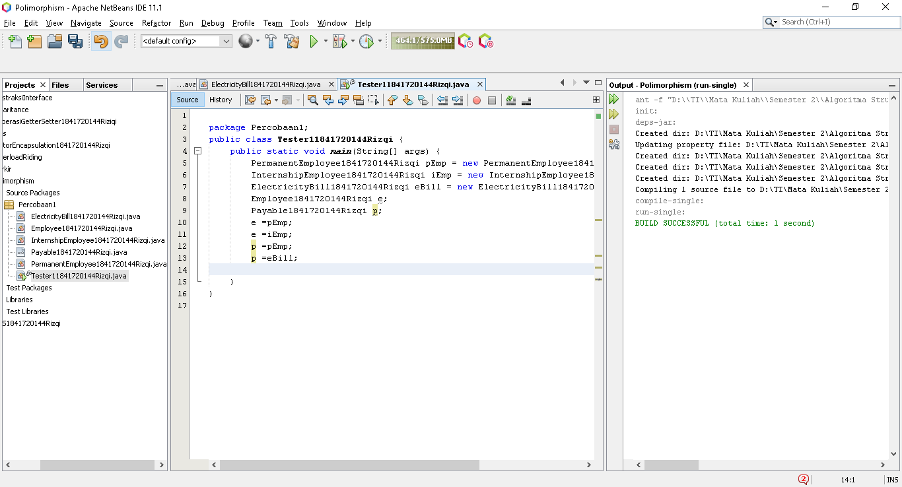

# Laporan Praktikum #10 - POLIMORFISME
## Kompetensi
Setelah melakukan percobaan pada jobsheet ini, diharapkan mahasiswa
mampu:
* Memahami konsep dan bentuk dasar polimorfisme.
* Memahami konsep virtual method invication.
* Menerapkan polimorfisme pada pembuatan heterogeneous collection.
* Menerapkan polimorfisme pada parameter/argument method.
* Menerapkan object casting untuk meng-ubah bentuk objek.
***
## Ringkasan Materi
* Virtual method Invocation
* Heterogeneous Collection
* Polymorphic Argument
* Operator instanceof
* Object Casting
***
## PERCOBAAN
### PERCOBAAN 1 - Abstract Class
  
>
>  
>[Kode program Percobaan 1 Employee1841720144Rizqi.java](../../src/10_Polimorfisme/Percobaan1/Employee1841720144Rizqi.java)  
>
>[Kode program Percobaan 1 Payable1841720144Rizqi.java](../../src/10_Polimorfisme/Percobaan1/Payable1841720144Rizqi.java)  
>
>[Kode program Percobaan 1 InternshipEmployee1841720144Rizqi.java](../../src/10_Polimorfisme/Percobaan1/InternshipEmployee1841720144Rizqi.java)  
>
>[Kode program Percobaan 1 PermanentEmployee1841720144Rizqi.java](../../src/10_Polimorfisme/Percobaan1/PermanentEmployee1841720144Rizqi.java)  
>
>[Kode program Percobaan 1 ElectricityBill1841720144Rizqi.java](../../src/10_Polimorfisme/Percobaan1/ElectricityBill1841720144Rizqi.java)  
>
>[Kode program Percobaan 1 Tester11841720144Rizqi.java](../../src/10_Polimorfisme/Percobaan1/Tester11841720144Rizqi.java)  
>
### Pertanyaan
1. Class apa sajakah yang merupakan turunan dari class Employee?  
`Jawab`  
>Class PermanentEmployee dan InternshipEmployee.
2. Class apa sajakah yang implements ke interface Payable?  
`Jawab`  
>Class PermanentEmployee dan ElectricityBill.
3. Perhatikan class Tester1, baris ke-10 dan 11. Mengapa e, bisa diisi dengan objek pEmp (merupakan objek dari class PermanentEmployee) dan objek iEmp (merupakan objek dari class InternshipEmploye) ?  
`Jawab`  
>Karena class InternshipEmployee dan PermanentEmployee merupakan sub-class dari Class Employee.
4. Perhatikan class Tester1, baris ke-12 dan 13. Mengapa p, bisa diisi dengan objek pEmp (merupakan objek dari class PermanentEmployee) dan objek eBill (merupakan objek dari class ElectricityBill) ?  
`Jawab`  
>Karena Class PermanentEmployee dan ElectricityBill merupakan implementasi dari class Payable.
5. Coba tambahkan sintaks:
* p = iEmp;
* e = eBill;  
`Jawab`  
>* Karena Class Payable dengan InternshipEmployee tidak ada hubungannuya 
>* Class Employee juga tidak terhubung dengan ElectricityBill.
6. Ambil kesimpulan tentang konsep/bentuk dasar polimorfisme!  
`Jawab`  
>ketika ada suatu objek yang dideklarasikan dari
super class, maka objek tersebut bisa diinstansiasi sebagai objek dari sub
class

***
### PERCOBAAN 2 - Virtual method invocation
>  
>[Kode program Percobaan 2 Tester21841720144Rizqi.java](../../src/10_Polimorfisme/Percobaan1/Tester21841720144Rizqi.java)
### Pertanyaan
1. Perhatikan class Tester2 di atas, mengapa pemanggilan e.getEmployeeInfo() pada baris 8 dan pEmp.getEmployeeInfo() pada baris 10 menghasilkan hasil sama?  
`Jawab`  
>Karena e = pEmp; dimana e mereferensikan Class Employee dan pEmp mereferensikan PermanentEmployee.
dan e deireferensikan ke pEmp.
2. Mengapa pemanggilan method e.getEmployeeInfo() disebut sebagai pemanggilan method virtual (virtual method invication), sedangkan pEmp.getEmployeeInfo() tidak?  
`Jawab`  
>Karena method e.getEmployeeInfo() saat dijalankan akan menjalankan method getEmployeeInfo() yang ada pada class PermanentEmployee terjadi karena ada pemanggilan overriding method dari suatu objek polimorfisme.  
3. Jadi apakah yang dimaksud dari virtual method invocation? Mengapa
disebut virtual?  
`Jawab`  
>Virtual method invocation terjadi ketika ada pemanggilan overriding method
dari suatu objek polimorfisme. Disebut virtual karena antara method yang
dikenali oleh compiler dan method yang dijalankan oleh JVM berbeda.
***
### PERCOBAAN 3 - Heterogenous Collection

>  
>[Kode program Percobaan 3 Tester31841720144Rizqi.java](../../src/10_Polimorfisme/Percobaan1/Tester31841720144Rizqi.java)
### Pertanyaan 
1. Perhatikan array e pada baris ke-8, mengapa ia bisa diisi dengan objek-objek dengan tipe yang berbeda, yaitu objek pEmp (objek dari PermanentEmployee) dan objek iEmp (objek dari InternshipEmployee) ?  
`Jawab`  
>Karena Class PermanentEmployee dan InternshipEmployee merupakan Sub-class dari Class Employee.
2. Perhatikan juga baris ke-9, mengapa array p juga biisi dengan objekobjek dengan tipe yang berbeda, yaitu objek pEmp (objek dari PermanentEmployee) dan objek eBill (objek dari ElectricityBilling) ?  
`Jawab`  
>Karena ClassPermanentEmployee dan ElectricityBill Implementasi dari Class Payable.
3. Perhatikan baris ke-10, mengapa terjadi error?  
`Jawab`  
>Karena eBill tidak mempunyai hubungan dengan Class Employee.
***
