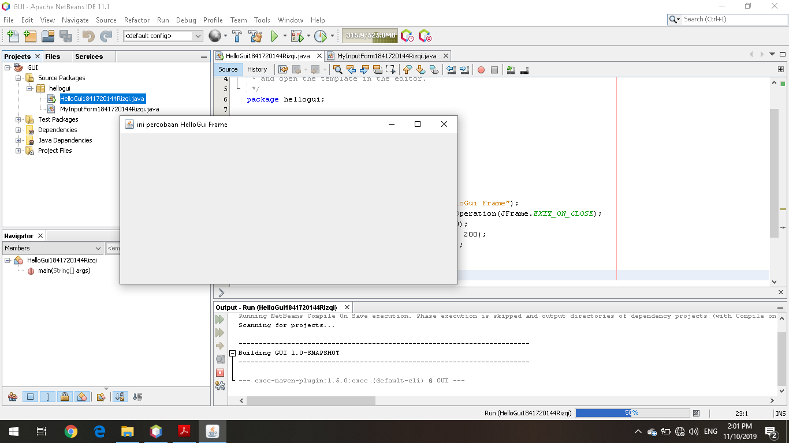

# Laporan Praktikum #11 - GUI
## Kompetensi
1. Membuat aplikasi Graphical User Interface sederhana dengan bahasa pemrograman java;
2. Mengenal komponen GUI seperti frame, label, textfield, combobox, radiobutton, checkbox, textarea, menu, serta table;
3. Menambahkan event handling pada aplikasi GUI.
___
## Ringkasan Materi
* JFrame Untuk membuat aplikasi Java berbasis GUI, kita butuh sebuah frame atau applet untuk media eksekusi aplikasi GUI. Pada Java sebuah frame dapat diwakili oleh sebuah kelas, yaitu JFrame. Melalui kelas JFrame kita bisa mendesain tampilan Java GUI sesuai kebutuhan
* Input Pada GUI memanfaatkan komponen-komponen GUI pada Java untuk menangani inputan, dengan memanfaatkan JFrame, JButton, JLabel, JTextField, JPanel dsb
* Manajemen Layout Java GUI menyediakan beberapa layout yang dapat digunakan pada program. Pada modul praktikum ini akan dijelaskan 3 contoh GUI layout, yaitu:
    - Border layout
    - Grid layout
    - Box layout
***
## PERCOBAAN
### PERCOBAAN 1 - JFrame HelloGUI 
>
>  
>[Kode program Percobaan 1 Employee1841720144Rizqi.java](../../src/10_Polimorfisme/Percobaan1/Employee1841720144Rizqi.java)  
>
