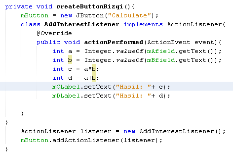

# Laporan Praktikum #11 - GUI
## Kompetensi
1. Membuat aplikasi Graphical User Interface sederhana dengan bahasa pemrograman java;
2. Mengenal komponen GUI seperti frame, label, textfield, combobox, radiobutton, checkbox, textarea, menu, serta table;
3. Menambahkan event handling pada aplikasi GUI.
___
## Ringkasan Materi
* JFrame Untuk membuat aplikasi Java berbasis GUI, kita butuh sebuah frame atau applet untuk media eksekusi aplikasi GUI. Pada Java sebuah frame dapat diwakili oleh sebuah kelas, yaitu JFrame. Melalui kelas JFrame kita bisa mendesain tampilan Java GUI sesuai kebutuhan
* Input Pada GUI memanfaatkan komponen-komponen GUI pada Java untuk menangani inputan, dengan memanfaatkan JFrame, JButton, JLabel, JTextField, JPanel dsb
* Manajemen Layout Java GUI menyediakan beberapa layout yang dapat digunakan pada program. Pada modul praktikum ini akan dijelaskan 3 contoh GUI layout, yaitu:
    - Border layout
    - Grid layout
    - Box layout
***
## PERCOBAAN
### PERCOBAAN 1 - JFrame HelloGUI 
>
>  
>  
>[Kode program Percobaan 1 HelloGui1841720144Rizqi.java](../../src/11_GUI/hellogui/HelloGui1841720144Rizqi.java)  
>
___
### Percobaan 2 - Menangani Input Pada GUI
>  
>    
>
>[Kode program Percobaan 2 MyInputForm1841720144Rizqi.java](../../src/11_GUI/hellogui/MyInputForm1841720144Rizqi.java)  
>
## Pertanyaan 
1. Modifikasi kode program dengan menambahkan JButton baru untuk melakukan fungsi perhitungan penambahan, sehingga ketika button di klik (event click) maka akan menampilkan hasil penambahan dari nilai A dan B  
`Jawab`  
>  
>  
>  
>
***
### Percobaan 3 - Manajemen Layout
>  
>  
>  
>
>[Kode program Percobaan 3 Border1841720144Rizqi.java](../../src/11_GUI/ManajemenLayout/Border1841720144Rizqi.java)  
>[Kode program Percobaan 3 Grid1841720144Rizqi.java](../../src/11_GUI/ManajemenLayout/Grid1841720144Rizqi.java)  
>[Kode program Percobaan 3 Box1841720144Rizqi.java](../../src/11_GUI/ManajemenLayout/Box1841720144Rizqi.java)  
>[Kode program Percobaan 3 LayoutGUI1841720144Rizqi.java](../../src/11_GUI/ManajemenLayout/LayoutGUI1841720144Rizqi.java)  

### Pertanyaan
1. Apa perbedaan dari Grid Layout, Box Layout dan Border Layout?  
`Jawab`  
> * Border layout menyusun komponen ke lima bagian yaitu: NORTH, SOUTH, EAST,WEST,
and CENTER. Masing - masing bagian ini dapat menampung lebih dari satu komponen
> * Grid layout menempatkan komponen dalam bentuk “rectangular grid” dan membaginya ke
ukuran yang sama dalam bentuk kotak dan masing masing komponen di letakkan pada satu kotak
> * Box layout menempatkan komponen dalam satu baris atau satu kolom berbentuk box
2. Apakah fungsi dari masing-masing kode berikut?
  
`Jawab`  
> * Proses Inisiasi setiap objek yang akan membuat setiap frame layout.
> * setDefaultCloseOperation digunakan untuk perintah Program akan berhenti jika ditutup.
> * setVisible digunakan untuk menampilkan frame jika di set true;
***
### Percobaan 4 - Membuat GUI Melalui IDE Netbeans
>  
>  
>  
>
>[Kode program Percobaan 3 Swing1841720144Rizqi.java](../../src/11_GUI/ManajemenLayout/Swing1841720144Rizqi.java)  
>[Kode program Percobaan 3 Swing1841720144Rizqi.form](../../src/11_GUI/ManajemenLayout/Swing1841720144Rizqi.form)  

### Pertanyaan 
1. Apakah fungsi dari kode berikut?
  
`Jawab`  
> Untuk menjalankan, membuat dan menampilkan form.
2. Mengapa pada bagian logika checkbox dan radio button digunakan multiple if ?  
`Jawab`  
> Karena kita membuat kondisi di setiap variable di checkbox dan radio button.
3. Lakukan modifikasi pada program untuk melakukan menambahkan inputan berupa alamat dan berikan fungsi pemeriksaan pada nilai Alamat tersebut jika belum diisi dengan menampilkan pesan peringatan.  
`Jawab/Hasil`  
>  
***

