# Laporan Praktikum #12 - Collection (List, Set, Map) dan Database
## Kompetensi
* Memahami cara penyimpanan objek menggunakan Collection dan Map.
* Mengetahui pengelompokan dari Collection.
* Mengetahui perbedaan dari interface Set, List dan Map.
* Mengetahui penggunaan class-class dari interface Set, List, dan Map.
* Memahami koneksi database menggunakan JDBC dan JDBC API

***
## Ringkasan Materi

1. Set  
Set mengikuti model himpunan, dimana objek/anggota yang tersimpan dalam Set harus unik. Urutan maupun letak dari anggota tidak penting, hanya keberadaan anggota saja yang penting.

2. List
List digunakan untuk menyimpan sekumpulan objek berdasarkan urutan masuk (ordered) dan menerima duplikat. Cara penyimpanannya seperti array, oleh sebab itu memiliki posisi awal dan posisi akhir, menyisipkan objek pada posisi tertentu, mengakses dan menghapus isi list, dimana semua proses ini selalu didasarkan pada urutannya.

3. Map  
Perbedaaan mendasar map dengan collection yang lain, untuk menyimpan objek pada Map, perlu sepasang objek, yaitu key yang bersifat unik dan nilai yang disimpan. Untuk mengakses nilai tersebut maka kita perlu mengetahui key dari nilai tersebut. Map juga dikenal sebagai dictionary/kamus. Pada saat menggunakan kamus, perlu suatu kata yang digunakan untuk pencarian.
***
## Percobaan
### Percobaan 1
>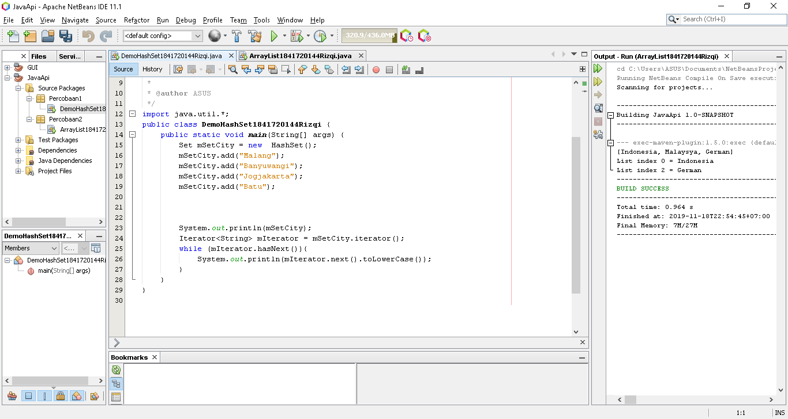
>[Kode program Percobaan 1 DemoHashSet1841720144Rizqi.java](../../src/12_Java_API/Percobaan1/DemoHashSet1841720144Rizqi.java)  

#### Pertanyaan 1 
1. Apakah fungsi import java.util.*; pada program diatas!  
`Jawab`  
>Untuk import semua library yang berada pada java.util.

2. Pada baris program keberapakah yang berfungsi untuk menciptakan object HashSet?  
`Jawab`  
>Set mSetCity = new HashSet();
3. Apakah fungsi potongan program dibawah ini pada percobaan 1!  
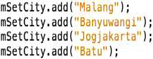  
`Jawab`  
>Untuk memasukkan data ke Object HashSet.
4. Tambahkan set.add(“Malang”); kemudian jalankan program! Amati hasilnya dan jelaskan mengapa terjadi error!  
`Jawab`  
>Karena data tersebut sama, Set tidak boleh sama atau Set harus unik.
5. Jelaskan fungsi potongan program dibawah ini pada percobaan 1!   
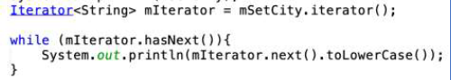   
`Jawab`  
>Menampilkan nilai dengan lowercase.
***
### Percobaan 2
>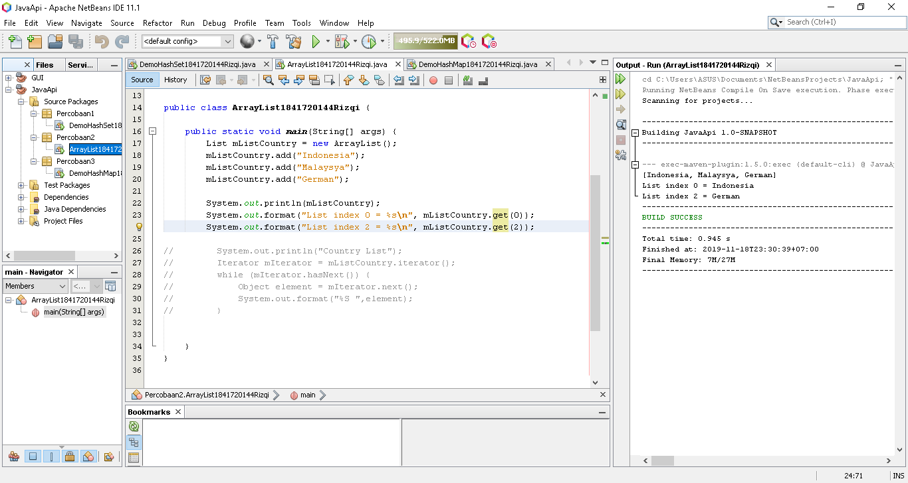
>[Kode program Percobaan 2 ArrayList1841720144Rizqi.java](../../src/12_Java_API/Percobaan2/ArrayList1841720144Rizqi.java)  
### Pertanyaan 2
1. Apakah fungsi potongan program dibawah ini!  
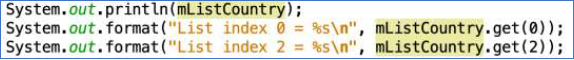   
`Jawab`  
>mListCountry.get(x) untuk menampilkan data pada index ke x.
2. Ganti potongan program pada soal no 1 menjadi sebagai berikut  
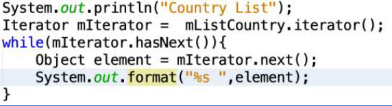   
`Jawab`  
>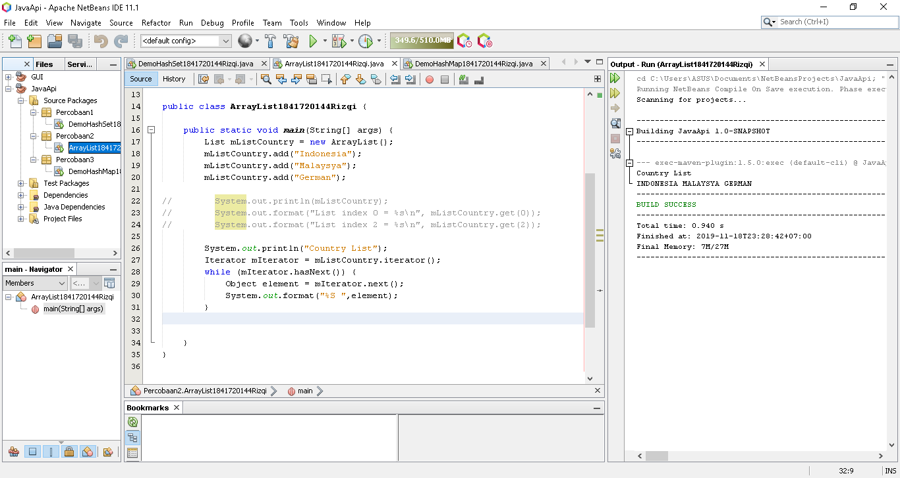  
3. Jelaskan perbedaan menampilkan data pada ArrayList menggunakan potongan program pada soal no 1 dan no 2!  
`Jawab`  
>Soal no 1 menggunakan input data index array, soal no 2 menggunakan iterasi jika ada data maka akan di tampilkan secara berurutan, jika tidak ada data maka proses iterasi akan berhenti.
*** 

### Percobaan 3
>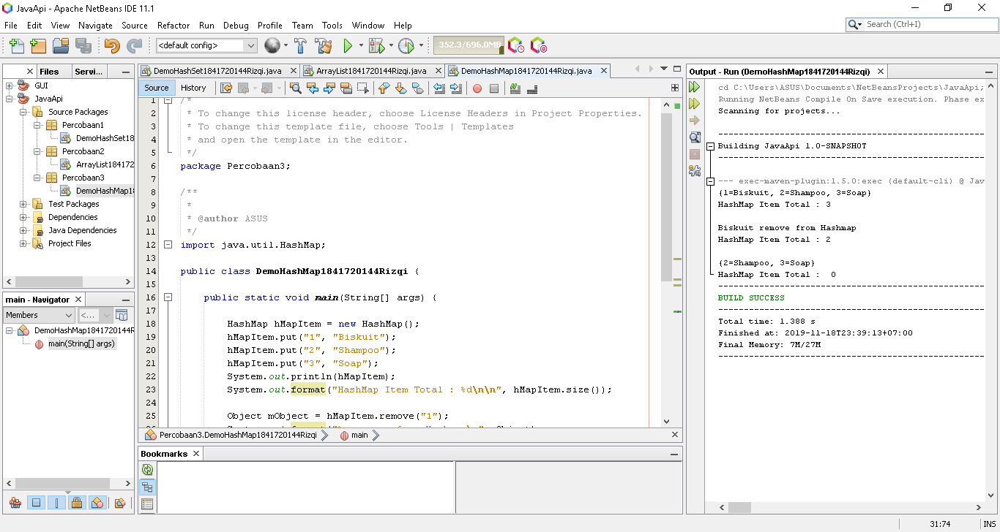
>[Kode program Percobaan 3 DemoHashMap1841720144Rizqi.java](../../src/12_Java_API/Percobaan3/DemoHashMap1841720144Rizqi.java)  
### Pertanyaan 3
1. Jelaskan fungsi hMapItem.put("1","Biskuit") pada program!  
`Jawab`  
>Digunakan untuk memasukkan data dengan key.
2. Jelaskan fungsi hMapItem.size() pada program!  
`Jawab`  
>Untuk jumlah data berseta key nya pada map.
3. Jelaskan fungsi hMapItem.remove("1") pada program!  
`Jawab`  
>Menghapus data dengan key "1".
4. Jelaskan fungsi hMapItem.clear() pada program!  
`Jawab`  
>Menghapus semua data pada map.
5. Tambahkan kode program yang di blok pada program yang sudah anda buat!  
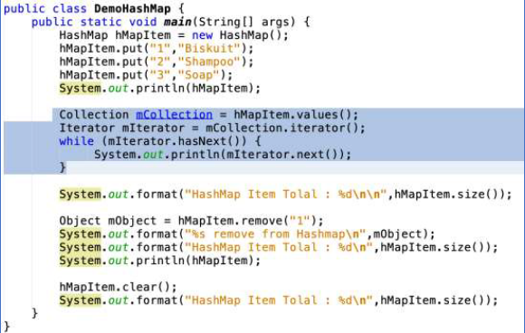   
`Jawab`  
>
  
6. Jalankan program dan amati apa yang terjadi!  
`Hasil`  
>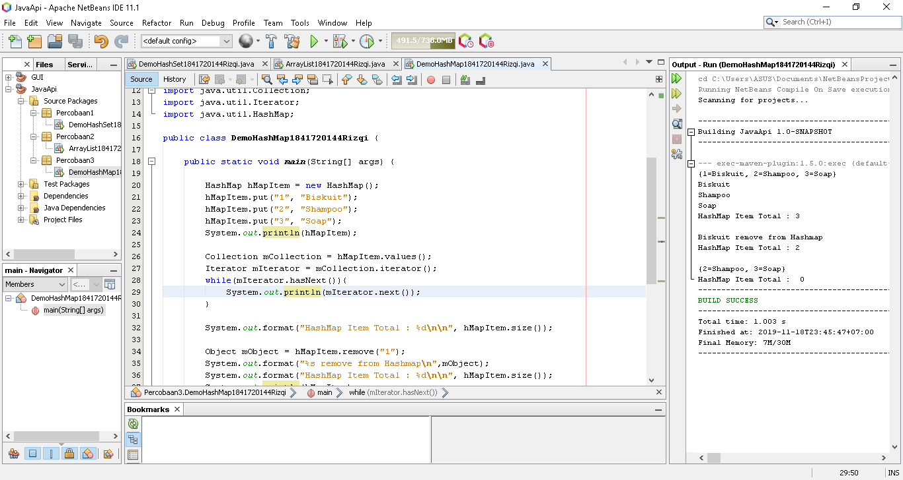 
7. Apakah perbedaan program sebelumnya dan setelah ditambahkan kode program pada soal no
5 diatas? Jelaskan!  
`Jawab`  
>Menampilkan data Menggunakan Iterator.
***
### Percobaan 4
>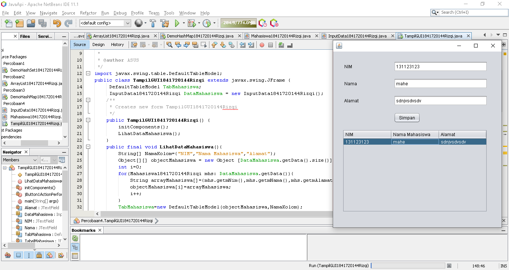
>[Kode program Percobaan 4 InputData1841720144Rizqi.java](../../src/12_Java_API/Percobaan4/InputData1841720144Rizqi.java)      
>[Kode program Percobaan 4 Mahasiswa1841720144Rizqi.java](../../src/12_Java_API/Percobaan4/Mahasiswa1841720144Rizqi.java)   
>[Kode program Percobaan 4 TampilGUI1841720144Rizqi.form](../../src/12_Java_API/Percobaan4/TampilGUI1841720144Rizqi.form)   
>[Kode program Percobaan 4 TampilGUI1841720144Rizqi.java](../../src/12_Java_API/Percobaan4/TampilGUI1841720144Rizqi.java)   
***
### Percobaan 5
>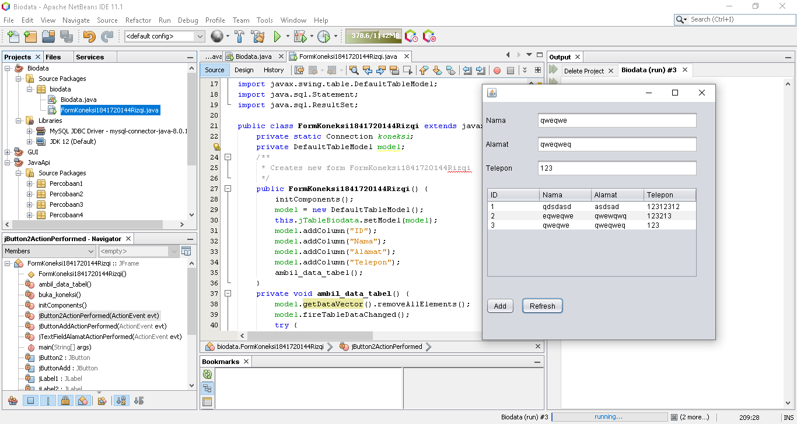
>[Kode program Percobaan 5 FormKoneksi1841720144Rizqi.form](../../src/12_Java_API/Percobaan4/FormKoneksi1841720144Rizqi.form)      
>[Kode program Percobaan 5 FormKoneksi1841720144Rizqi.java](../../src/12_Java_API/Percobaan4/FormKoneksi1841720144Rizqi.java)   
***
### Pertanyaan 
5. Setelah menambah code pada action button klik, coba jalankan program dan tambahkan data. Apakah program berhasil menambahkan data? Jika tidak apakah penyebabnya.  
`Jawab`  
>Belum bisa tampil di tabel tetapi program sukses.
6. Jelaskan maksud source code untuk melakukan insert data diatas?  
`Jawab`  
>Untuk memasukkan data ke database menggunakan bahasa sql.
9. Jelaskan alur dari method ambil_data_tabel?<br>`Jawab`      
>pertama akan mengeksekusi buka koneksi jika gagal akan terdapat pesan error.], jika berhasil data akan dimasukan satu persatu.
10. Buat fungsi untuk merefresh sehingga data yang baru dapat ditampilkan pada tabel.  
`Jawab`  
>```
>private void jButtonRefreshActionPerformed?(java.awt.event.ActionEvent evt) {                    >                           
>    ambil_data_tabel();
>}
>```

***
## Kesimpulan

* Belajar cara penyimpanan objek menggunakan Collection dan Map.
* Mengenali pengelompokan dari Collection.  
* Mengenali perbedaan dari interface Set, List dan Map.  
* Belajar mengggunaan class-class dari interface Set, List, dan Map.  
* Belajar koneksi database menggunakan JDBC dan JDBC API
***
## Pernyataan Diri

Saya menyatakan isi tugas, kode program, dan laporan praktikum ini dibuat oleh saya sendiri. Saya tidak melakukan plagiasi, kecurangan, menyalin/menggandakan milik orang lain.

Jika saya melakukan plagiasi, kecurangan, atau melanggar hak kekayaan intelektual, saya siap untuk mendapat sanksi atau hukuman sesuai peraturan perundang-undangan yang berlaku.

Ttd,

***(Muhammad Rizqi Mahendra)***