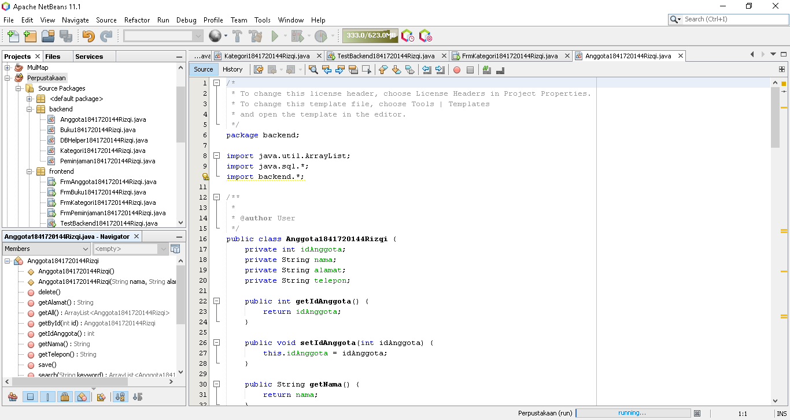

# Laporan Praktikum #14 - GUI dan Database
## Kompetensi
Setelah menempuh materi percobaan ini, mahasiswa mampu mengenal:
1. Menggunakan paradigma berorientasi objek untuk interaksi dengan database
2. Membuat backend dan frontend
3. Membuat form sebagai frontend
    ---
    ## Ringkasan Materi

* Membuat database dan tabel-tabelnya.
* Membuat backend yang berisi class-class yang mewakili data yang ada pada database, dan class helper untuk melakukan eksekusi query database.
* Membuat frontend yang merupakan antarmuka kepada pengguna. Frontend ini bisa berbasis teks (console), GUI, web, mobile, dan sebagainya.

Library yang digunakan untuk project ini antara lain:
1. JDBC, untuk melakukan interaksi ke database.
2. ArrayList, untuk menampung data hasil query ke database.
3. Swing, untuk membuat tampilan GUI.

---
## Percobaan
### Percobaan 1
>
---
### Percobaan 2
1. Buat project baru, beri nama Perpustakaan.
2. Pada project explorer, klik kanan pada Libraries → Add Library, pilih MySQL JDBC Driver.
3. Buat package frontend dan backend. Cara membuat package adalah, pada project explorer, klik kanan pada Source Packages → New → Java Package, beri nama package nya (frontend, backend).

>
---
### Percobaan 3
>
[Kode program Percobaan 3 DBHelper1841720144Rizqi.java](../../src/14_GUI_dan_Database/backend/DBHelper1841720144Rizqi.java)

---
### Percobaan 4
>
[Kode program Percobaan 4 Kategori1841720144Rizqi.java](../../src/14_GUI_dan_Database/backend/Kategori1841720144Rizqi.java)

---

### Percobaan 5
>
[Kode program Percobaan 5 TestBackend1841720144Rizqi.java](../../src/14_GUI_dan_Database/frontend/TestBackend1841720144Rizqi.java)

---
### Percobaan 6
>
>
`Hasil`
>
>  Tambah Baru
>  Hapus
>  Cari

[Kode program Percobaan 5 FrmKategori1841720144Rizqi.java](../../src/14_GUI_dan_Database/frontend/FrmKategori1841720144Rizqi.java)  
[Kode program Percobaan 5 FrmKategori1841720144Rizqi.form](../../src/14_GUI_dan_Database/frontend/FrmKategori1841720144Rizqi.form)

---
### Percobaan 6b
>
>

[Kode program Percobaan 6b Anggota1841720144Rizqi.java](../../src/14_GUI_dan_Database/backend/Anggota1841720144Rizqi.java)  
[Kode program Percobaan 6b TestBackendAnggota1841720144Rizqi.java](../../src/14_GUI_dan_Database/frontend/TestBackendAnggota1841720144Rizqi.java)

---

### Percobaan 7
>
>
`Hasil`
>
[Kode program Percobaan 7 FrmAnggota1841720144Rizqi.java](../../src/14_GUI_dan_Database/frontend/FrmAnggota1841720144Rizqi.java)  
[Kode program Percobaan 7 FrmAnggota1841720144Rizqi.form](../../src/14_GUI_dan_Database/frontend/FrmAnggota1841720144Rizqi.form)

---
### Percobaan 7b
>
>

[Kode program Percobaan 7b Buku1841720144Rizqi.java](../../src/14_GUI_dan_Database/backend/Buku1841720144Rizqi.java)  
[Kode program Percobaan 7b TestBackendBuku1841720144Rizqi.java](../../src/14_GUI_dan_Database/frontend/TestBackendBuku1841720144Rizqi.java)

---
### Percobaan 8
>
>
`Hasil`
>
>  Tambah Baru
>  Hapus
>  Cari

[Kode program Percobaan 8 FrmBuku1841720144Rizqi.java](../../src/14_GUI_dan_Database/frontend/FrmBuku1841720144Rizqi.java)  
[Kode program Percobaan 8 FrmBuku1841720144Rizqi.form](../../src/14_GUI_dan_Database/frontend/FrmBuku1841720144Rizqi.form)

---
## TUGAS
>
>
>
>  
> 
`Hasil`   
>   
>   
>   

[Kode program Tugas Peminjaman1841720144Rizqi.java](../../src/14_GUI_dan_Database/backend/Peminjaman1841720144Rizqi.java)  
[Kode program Tugas TesBeckendPinjam1841720144Rizqi.java](../../src/14_GUI_dan_Database/frontend/TesBeckendPinjam1841720144Rizqi.java)  
[Kode program Tugas FrmPeminjaman1841720144Rizqi.java](../../src/14_GUI_dan_Database/frontend/FrmPeminjaman1841720144Rizqi.java)  
[Kode program Tugas FrmPeminjaman1841720144Rizqi.form](../../src/14_GUI_dan_Database/frontend/FrmPeminjaman1841720144Rizqi.form)

---
## Kesimpulan

Menggunakan paradigma berorientasi objek yang telah kita pelajari untuk membuat aplikasi berbasis database dan dilengkapi dengan form sebagai Graphical User Interface (GUI). Secara umum, tahapan yang akan kita lakukan adalah sebagai berikut:

* Membuat database dan tabel-tabelnya.
* Membuat backend yang berisi class-class yang mewakili data yang ada pada database, dan class helper untuk melakukan eksekusi query database.
* Membuat frontend yang merupakan antarmuka kepada pengguna. Frontend ini bisa berbasis teks (console), GUI, web, mobile, dan sebagainya.
---
## Pernyataan Diri

Saya menyatakan isi tugas, kode program, dan laporan praktikum ini dibuat oleh saya sendiri. Saya tidak melakukan plagiasi, kecurangan, menyalin/menggandakan milik orang lain.

Jika saya melakukan plagiasi, kecurangan, atau melanggar hak kekayaan intelektual, saya siap untuk mendapat sanksi atau hukuman sesuai peraturan perundang-undangan yang berlaku.

Ttd,

***(Muhammad Rizqi Mahendra)***
