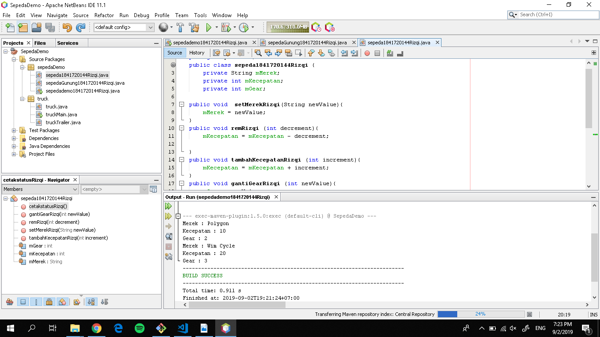
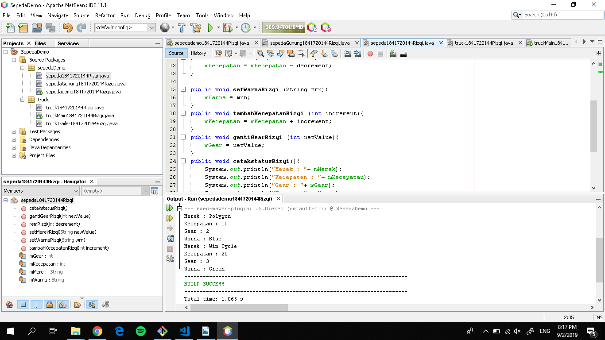
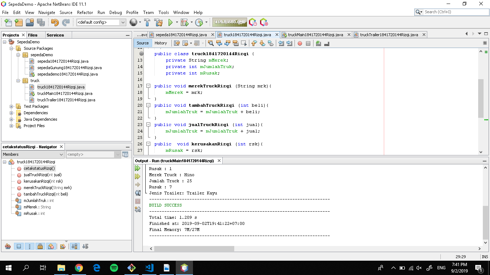

# Laporan Praktikum #1 - Pengantar Konsep PBO

## Kompetensi

Setelah menempuh materi percobaan ini, mahasiswa mampu mengenal:
1. Perbedaan paradigma berorientasi objek dengan paradigma struktural
2. Konsep dasar PBO

## Ringkasan Materi

(berisi catatan penting pribadi selama praktikum berlangsung ataupun menemukan permasalahan khusus saat melakukan percobaan)

## Percobaan

### Percobaan 1

Percobaan 1
Didalam percobaan ini, kita akan mendemonstrasikan bagaimana membuat class, membuat object, kemudian mengakses method didalam class tersebut.

Contoh link kode program : [ini contoh link ke kode program](../../src/1_Pengantar_Konsep_PBO/Contoh12345Habibie.java)

### Percobaan 2

Didalam percobaan ini, akan didemonstrasikan salah satu fitur yang paling penting dalam PBO, yaitu inheritance. Disini kita akan membuat class SepedaGunung yang mana adalah turunan/warisan dari class Sepeda. Pada dasarnya class SepedaGunung adalah sama dengan class Sepeda, hanya saja pada sepeda gunung terdapat tipe suspensi. Untuk itu kita tidak perlu membuat class Sepeda Gunung dari nol, tapi kita wariskan saja class Sepeda ke class SepedaGunung.

Contoh link kode program : [ini contoh link ke kode program](../../src/1_Pengantar_Konsep_PBO/Contoh12345Habibie.java)

## Pertanyaan
**1. Sebutkan dan jelaskan aspek-aspek yang ada pada pemrograman berorientasi objek!**

    Jawaban : Object, Class, Enkapsulasi, Inheritance dan Polimorfisme.

**2. Apa yang dimaksud dengan object dan apa bedanya dengan class?**

    Jawaban : Object adalah suatu rangkaian dalam program yang terdiri dari state dan behaviour. Object pada software dimodelkan sedemikian rupa sehingga mirip dengan objek yang ada di dunia nyata
    
    Class adalah blueprint atau prototype dari objek. Ambil contoh objek sepeda. Terdapat berbagai macam sepeda di dunia, dari berbagai merk dan model.
**3. Sebutkan salah satu kelebihan utama dari pemrograman berorientasi objek dibandingkan dengan pemrograman struktural!**

    Jawaban : Perbedaan mendasar antara pemrograman terstruktur dengan pemrograman berorientasi objek (PBO) atau Object Oriented Programming (OOP) adalah: Pada pemrograman terstruktur, program dipecah kedalam sub-program atau fungsi. Sedangkan pada PBO, program dipecah kedalam objek, dimana objek tersebut membungkus state dan method.

**4. Pada class Sepeda, terdapat state/atribut apa saja?**

    Jawaban : Merek, kecepatan dan gear

**5. Tambahkan atribut warna pada class Sepeda.**

    Jawaban : 

Contoh link kode program : [ini contoh link ke kode program](../../src/1_Pengantar_Konsep_PBO/Contoh12345Habibie.java)

**6. Mengapa pada saat kita membuat class SepedaGunung, kita tidak perlu membuat class nya dari nol?**

    Jawaban : Karena class sepedagunung sudah extend atau sudah diwarisi oleh class sepeda.

## Tugas

Contoh link kode program : [ini contoh link ke kode program](../../src/1_Pengantar_Konsep_PBO/Contoh12345Habibie.java)

## Kesimpulan

Dengan belajar Praktikum ini mengerti Pemrograman Orientasi Objek

## Pernyataan Diri

Saya menyatakan isi tugas, kode program, dan laporan praktikum ini dibuat oleh saya sendiri. Saya tidak melakukan plagiasi, kecurangan, menyalin/menggandakan milik orang lain.

Jika saya melakukan plagiasi, kecurangan, atau melanggar hak kekayaan intelektual, saya siap untuk mendapat sanksi atau hukuman sesuai peraturan perundang-undangan yang berlaku.

Ttd,

***(Muhammad Rizqi Mahendra)***