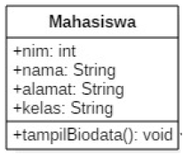
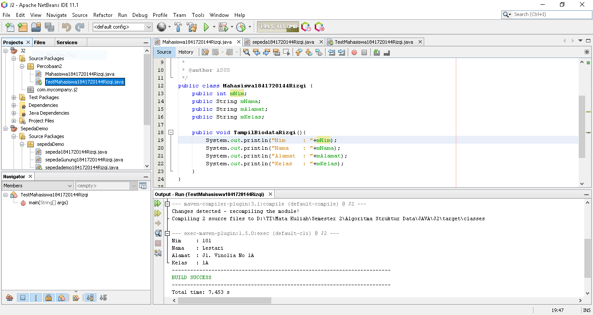
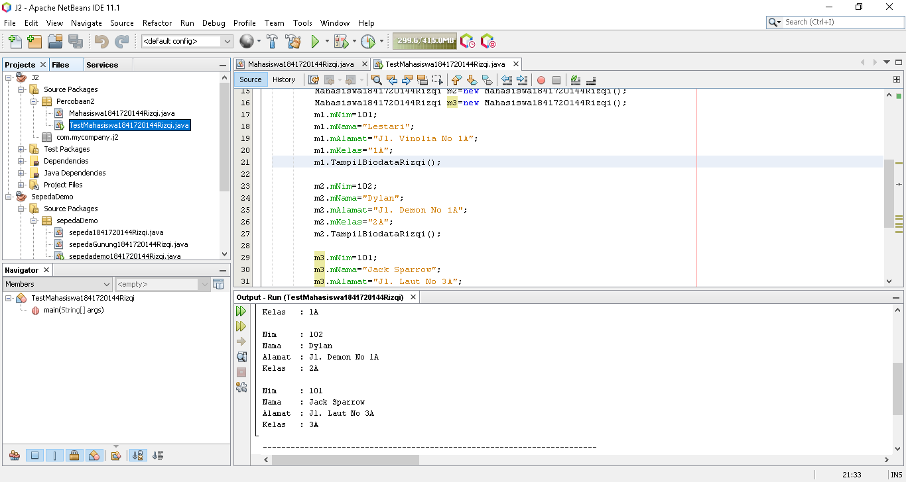
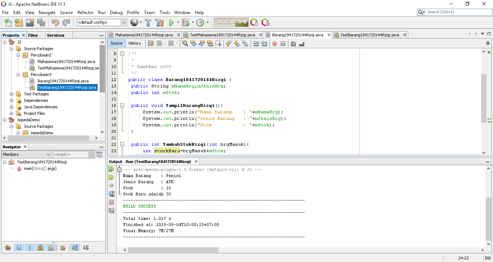

# Laporan Praktikum #2 - Pengantar Konsep PBO
***
## Kompetensi

Mahasiswa dapat memahami deskripsi dari class dan object
1.  Mahasiswa memahami implementasi dari class
2. Mahasiswa dapat memahami implementasi dari attribute
3. Mahasiswa dapat memahami implementasi dari method
4. Mahasiswa dapat memahami implementasi dari proses instansiasi
5. Mahasiswa dapat memahami implementasi dari try-catch
6. Mahasiswa dapat memahami proses pemodelan class diagram menggunakan UML
---


## Ringkasan Materi

- Perbedaan methode void dengan int.   
- Deklarasi attribut dan method.  
- Instansiasi objek.
---


## Percobaan

### ****Percobaan 1****

    Dalam suatu perusahaan salah satu data yang diolah adalah data karyawan. Setiap karyawan memiliki id, nama, jenis kelamin, jabatan, jabatan, dan gaji. Setiap mahasiswa juga bisa menampilkan data diri pribadi dan melihat gajinya.  

>

### ****Percobaan 2****

    Perhatikan class diagram dibawah ini. Buatlah program berdasarkan class diagram tersebut!  



>
                
**7. Jelaskan pada bagian mana proses pendeklarasian atribut pada program diatas!**

```
public int mNim;
public String mNama;
public String mAlamat;
public String mKelas;
```


**8. Jelaskan pada bagian mana proses pendeklarasian method pada program diatas!**  

```public void TampilBiodataRizqi(){
System.out.println("Nim     : "+mNim);
System.out.println("Nama    : "+mNama);
System.out.println("Alamat  : "+mAlamat);
System.out.println("Kelas   : "+mKelas);
```

**9. Berapa banyak objek yang di instansiasi pada program diatas!**

>Ada Satu
```
Mahasiswa1841720144Rizqi m1=new Mahasiswa1841720144Rizqi();
```

**10. Apakah yang sebenarnya dilakukan pada sintaks program “mhs1.nim=101” ?**

>Objek akan memanggil atribut mNim dan akan diisi dengan nilai "101"

**11. Apakah yang sebenarnya dilakukan pada sintaks program “mhs1.tampilBiodata()” ?**

>Objek akan memanggil method TampilBiodataRizqi() pada class Mahasiswa1841720144Rizqi.java

**12. Instansiasi 2 objek lagi pada program diatas!**

>
[Kode Program Mahasiswa1841720144Rizqi](../../src/2_Class_dan_Object\Percobaan2\Mahasiswa1841720144Rizqi.java)  
[Kode Program TestMahasiswa1841720144Rizqi](../../src/2_Class_dan_Object\Percobaan2\TestMahasiswa1841720144Rizqi.java)


### ****Percobaan 3****
        
>*Menulis method yang memiliki argument/parameter dan memiliki return*



**7. Apakah fungsi argumen dalam suatu method?**
>
**8. Ambil kesimpulan tentang kegunaan dari kata kunci return , dan kapan suatu method harus memiliki return!**

 

## **Pertanyaan**
**1. Sebutkan dan jelaskan aspek-aspek yang ada pada pemrograman berorientasi objek!**

    Jawaban : Object, Class, Enkapsulasi, Inheritance dan Polimorfisme.

**2. Apa yang dimaksud dengan object dan apa bedanya dengan class?**

    Jawaban : Object adalah suatu rangkaian dalam program yang terdiri dari state dan behaviour. Object pada software dimodelkan sedemikian rupa sehingga mirip dengan objek yang ada di dunia nyata.
    
    Class adalah blueprint atau prototype dari objek. Ambil contoh objek sepeda. Terdapat berbagai macam sepeda di dunia, dari berbagai merk dan model.
**3. Sebutkan salah satu kelebihan utama dari pemrograman berorientasi objek dibandingkan dengan pemrograman struktural!**

    Jawaban : Perbedaan mendasar antara pemrograman terstruktur dengan pemrograman berorientasi objek (PBO) atau Object Oriented Programming (OOP) adalah: Pada pemrograman terstruktur, program dipecah kedalam sub-program atau fungsi. Sedangkan pada PBO, program dipecah kedalam objek, dimana objek tersebut membungkus state dan method.

**4. Pada class Sepeda, terdapat state/atribut apa saja?**

    Jawaban : Merek, kecepatan dan gear

**5. Tambahkan atribut warna pada class Sepeda.**

    Jawaban : 


[kode program](../../src/1_Pengantar_Konsep_PBO/sepeda1841720144Rizqi.java)

**6. Mengapa pada saat kita membuat class SepedaGunung, kita tidak perlu membuat class nya dari nol?**

    Jawaban : Karena class sepedagunung sudah extend atau sudah diwarisi oleh class sepeda.

## Tugas


[kode program](../../src/1_Pengantar_Konsep_PBO/truck1841720144Rizqi.java)

## Kesimpulan

Dengan belajar Praktikum ini mengerti Pemrograman Orientasi Objek

## Pernyataan Diri

Saya menyatakan isi tugas, kode program, dan laporan praktikum ini dibuat oleh saya sendiri. Saya tidak melakukan plagiasi, kecurangan, menyalin/menggandakan milik orang lain.

Jika saya melakukan plagiasi, kecurangan, atau melanggar hak kekayaan intelektual, saya siap untuk mendapat sanksi atau hukuman sesuai peraturan perundang-undangan yang berlaku.

Ttd,

***(Muhammad Rizqi Mahendra)***