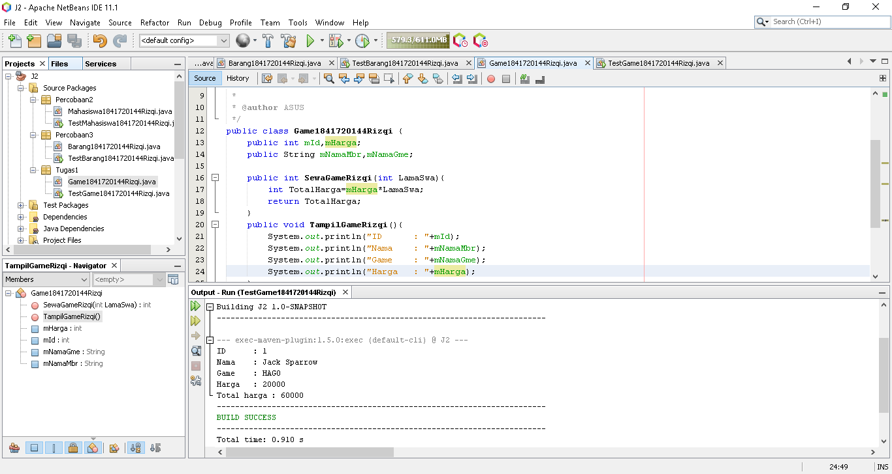
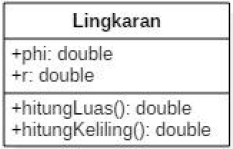
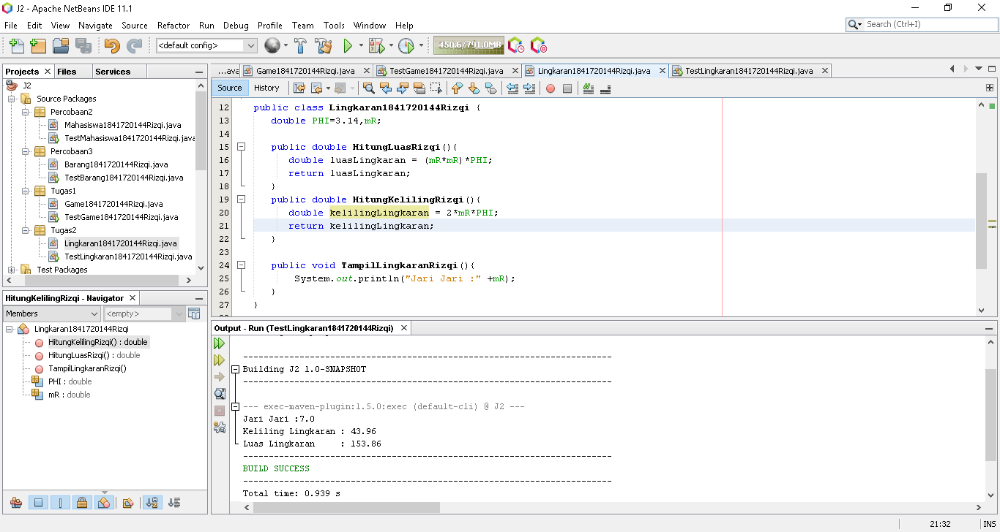
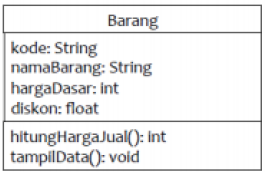
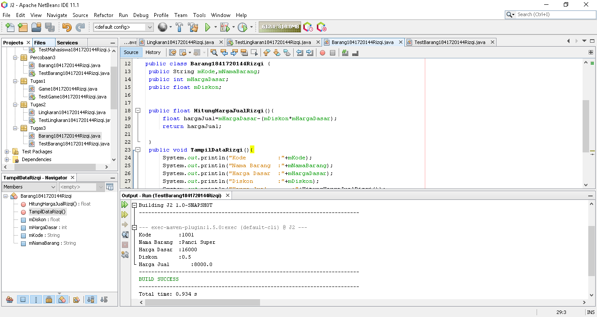

# Laporan Praktikum #2 - Class dan Objek
***
## Kompetensi

Mahasiswa dapat memahami deskripsi dari class dan object
1.  Mahasiswa memahami implementasi dari class
2. Mahasiswa dapat memahami implementasi dari attribute
3. Mahasiswa dapat memahami implementasi dari method
4. Mahasiswa dapat memahami implementasi dari proses instansiasi
5. Mahasiswa dapat memahami implementasi dari try-catch
6. Mahasiswa dapat memahami proses pemodelan class diagram menggunakan UML
---


## Ringkasan Materi

- Perbedaan methode void dengan int.   
- Deklarasi attribut dan method.  
- Instansiasi objek.
---


## Percobaan

### ****Percobaan 1****

    Dalam suatu perusahaan salah satu data yang diolah adalah data karyawan. Setiap karyawan memiliki id, nama, jenis kelamin, jabatan, jabatan, dan gaji. Setiap mahasiswa juga bisa menampilkan data diri pribadi dan melihat gajinya.  

>

### ****Percobaan 2****

    Perhatikan class diagram dibawah ini. Buatlah program berdasarkan class diagram tersebut!  


>
                
**7. Jelaskan pada bagian mana proses pendeklarasian atribut pada program diatas!**

```
public int mNim;
public String mNama;
public String mAlamat;
public String mKelas;
```


**8. Jelaskan pada bagian mana proses pendeklarasian method pada program diatas!**  

```public void TampilBiodataRizqi(){
System.out.println("Nim     : "+mNim);
System.out.println("Nama    : "+mNama);
System.out.println("Alamat  : "+mAlamat);
System.out.println("Kelas   : "+mKelas);
```

**9. Berapa banyak objek yang di instansiasi pada program diatas!**

>Ada Satu
```
Mahasiswa1841720144Rizqi m1=new Mahasiswa1841720144Rizqi();
```

**10. Apakah yang sebenarnya dilakukan pada sintaks program “mhs1.nim=101” ?**

>*Objek akan memanggil atribut mNim dan akan diisi dengan nilai "101"*

**11. Apakah yang sebenarnya dilakukan pada sintaks program “mhs1.tampilBiodata()” ?**

>*Objek akan memanggil method TampilBiodataRizqi() pada class Mahasiswa1841720144Rizqi.java*

**12. Instansiasi 2 objek lagi pada program diatas!**

>
[Kode Program Mahasiswa1841720144Rizqi](../../src/2_Class_dan_Object/Percobaan2/Mahasiswa1841720144Rizqi.java)  
[Kode Program TestMahasiswa1841720144Rizqi](../../src/2_Class_dan_Object/Percobaan2/TestMahasiswa1841720144Rizqi.java)


### ****Percobaan 3****
        
**Menulis method yang memiliki argument/parameter dan memiliki return**

>
[Kode Program Barang1841720144Rizqi](../../src/2_Class_dan_Object/Percobaan3/Barang1841720144Rizqi.java)  
[Kode Program TestBarang1841720144Rizqi](../../src/2_Class_dan_Object/Percobaan3/TestBarang1841720144Rizqi.java)

**7. Apakah fungsi argumen dalam suatu method?**
>*Untuk menentukan suatu nilai atau merubah suatu nilai*

**8. Ambil kesimpulan tentang kegunaan dari kata kunci return , dan kapan suatu method harus memiliki return!**

 >*Return digunakan untuk method yang mempunyai nilai balik, suatu method harus memiliki return ketika method memiliki nilai balik bukan void.*


## Tugas

**1. Suatu toko persewaan video game salah satu yang diolah adalah peminjaman, dimana data yang dicatat ketika ada orang yang melakukan peminjaman adalah id, nama member, nama game, dan harga yang harus dibayar. Setiap peminjaman bisa menampilkan data hasil peminjaman dan harga yang harus dibayar. Buatlah class diagram pada studi kasus diatas!**

**2. Buatlah program dari class diagram yang sudah anda buat di no 1!**

>
[Kode Program Game1841720144Rizqi](../../src/2_Class_dan_Object/Tugas1/Game1841720144Rizqi.java)  
[Kode Program TestGame1841720144Rizqi](../../src/2_Class_dan_Object/Tugas1/TestGame1841720144Rizqi.java)

**3. Buatlah program sesuai dengan class diagram berikut ini:**  



>
[Kode Program Lingkaran1841720144Rizqi](../../src/2_Class_dan_Object/Tugas2/Lingkaran1841720144Rizqi.java)  
[Kode Program TestLingkaran1841720144Rizqi](../../src/2_Class_dan_Object/Tugas2/TestLingkaran1841720144Rizqi.java)

**4. Buatlah program sesuai dengan class diagram berikut ini:**  



>
[Kode Program Barang1841720144Rizqi](../../src/2_Class_dan_Object/Tugas3/Barang1841720144Rizqi.java)  
[Kode Program TestBarang1841720144Rizqi](../../src/2_Class_dan_Object/Tugas3/TestBarang1841720144Rizqi.java)


## Kesimpulan

- Dengan belajar Praktikum ini mengerti Pemrograman Orientasi Objek
- Dapat membdakan method yang mempunyai nilai balik maupun tidak mempunyai nilai balik
- Dapal melakukan instansiasi objek


## Pernyataan Diri

Saya menyatakan isi tugas, kode program, dan laporan praktikum ini dibuat oleh saya sendiri. Saya tidak melakukan plagiasi, kecurangan, menyalin/menggandakan milik orang lain.

Jika saya melakukan plagiasi, kecurangan, atau melanggar hak kekayaan intelektual, saya siap untuk mendapat sanksi atau hukuman sesuai peraturan perundang-undangan yang berlaku.

Ttd,

***(Muhammad Rizqi Mahendra)***