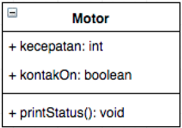
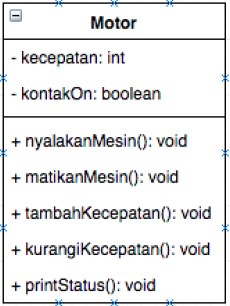
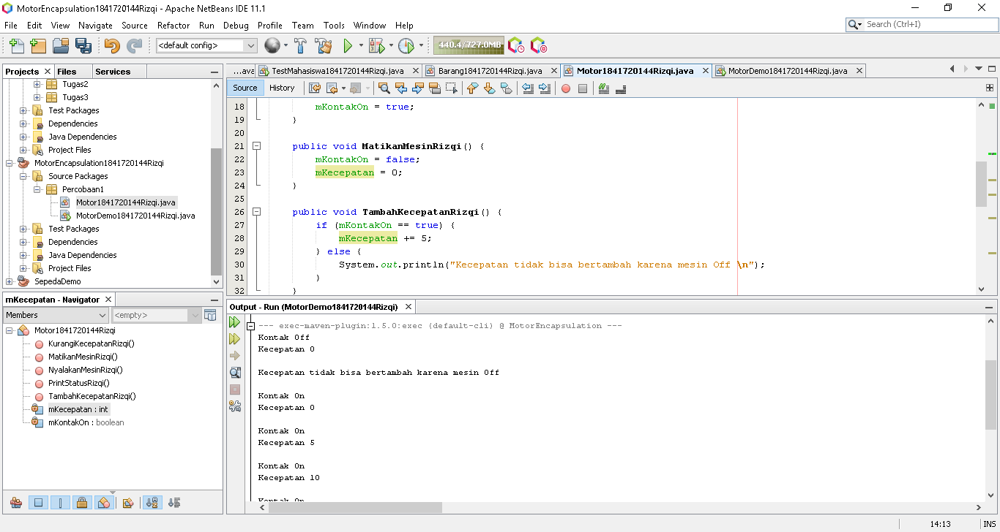
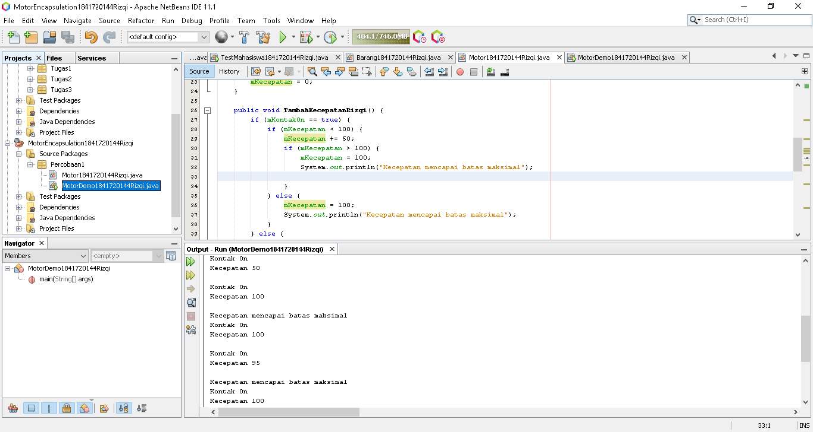
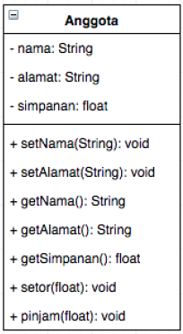
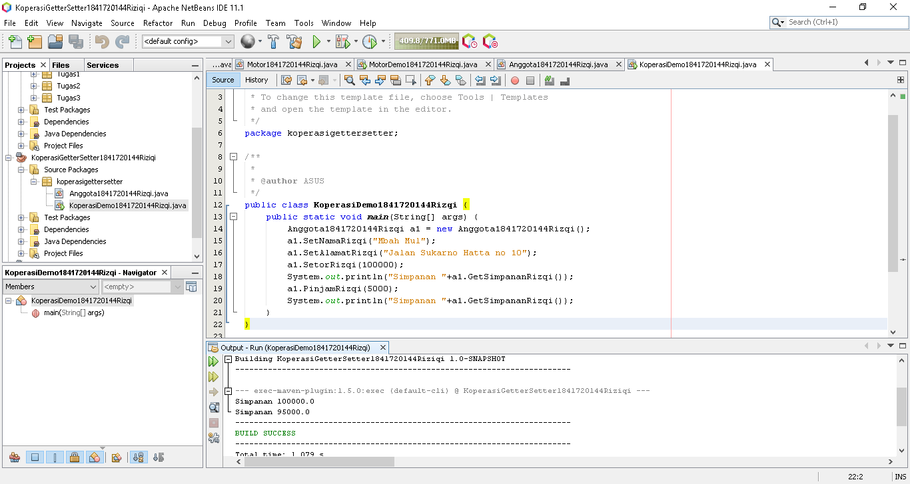

# Laporan Praktikum #3 - Enkapsulasi

## Kompetensi
Setelah melakukan percobaan pada modul ini, mahasiswa memahami konsep:
1. Konstruktor
2. Akses Modifier
3. Atribut/method pada class
4. Intansiasi atribut/method
5. Setter dan getter
6. Memahami notasi pada UML Class Diagram
---

## Ringkasan Materi
1. Getter dan Setter
2. Private Attribut
3. Konstraktor
---
## Percobaan
### ****Percobaan 1 - Enkapsulasi****

>

`Hasil`
>  
>[Kode program Percobaan 1 Motor1841720144Rizqi.java](../../src/3_Enkapsulasi/Percobaan1/Motor1841720144Rizqi.java)  
[Kode program Percobaan 1 MotorDemo1841720144Rizqi.java](../../src/3_Enkapsulasi/Percobaan1/MotorDemo1841720144Rizqi.java)
***

### ****Percobaan 2 - Access Modifier****

>  
Berdasarkan UML class diagram tersebut maka class Motor terdapat perubahan, yaitu:  
a. Ubah access modifier kecepatan dan kontakOn menjadi private  
b. Tambahkan method nyalakanMesin, matikanMesin tambahKecepatan, kurangiKecepatan.

`Hasil`
> 
>[Kode program Percobaan  2 Motor1841720144Rizqi.java](../../src/3_Enkapsulasi/Percobaan2/Motor1841720144Rizqi.java)  
[Kode program Percobaan 2  MotorDemo1841720144Rizqi.java](../../src/3_Enkapsulasi/Percobaan2/MotorDemo1841720144Rizqi.java)
***

### ****Pertanyaan****
>1. Pada class TestMobil, saat kita menambah
kecepatan untuk pertama kalinya, mengapa muncul peringatan “Kecepatan tidak bisa bertambah karena Mesin Off!”?  
>`Jawab: `  
Karena dalam program tertulis jika *Mesin dalam keadaan mati* maka tidak bisa melakukan **TambahKecepatan**.  
> 
>2. Mengapat atribut kecepatan dan kontakOn diset private?  
>`Jawab:`  
>Agar kelas lain tidak bisa memanggil attribut tersebut, dan Hanya bisa dipanggil dalam satu kelas yang sama.
>3. Ubah class Motor sehingga kecepatan maksimalnya adalah 100!  
>`Jawab:`  

***

### ****Percobaan 2 - Getter dan Setter****
>

`Hasil`

>
>[Kode program Percobaan 3  Anggota1841720144Rizqi.java](../../src/3_Enkapsulasi/Percobaan3/Anggota1841720144Rizqi.java)  
>[Kode program Percobaan 3  KoperasiDemo1841720144Rizqi.java](../../src/3_Enkapsulasi/Percobaan3/KoperasiDemo1841720144Rizqi.java)
***
