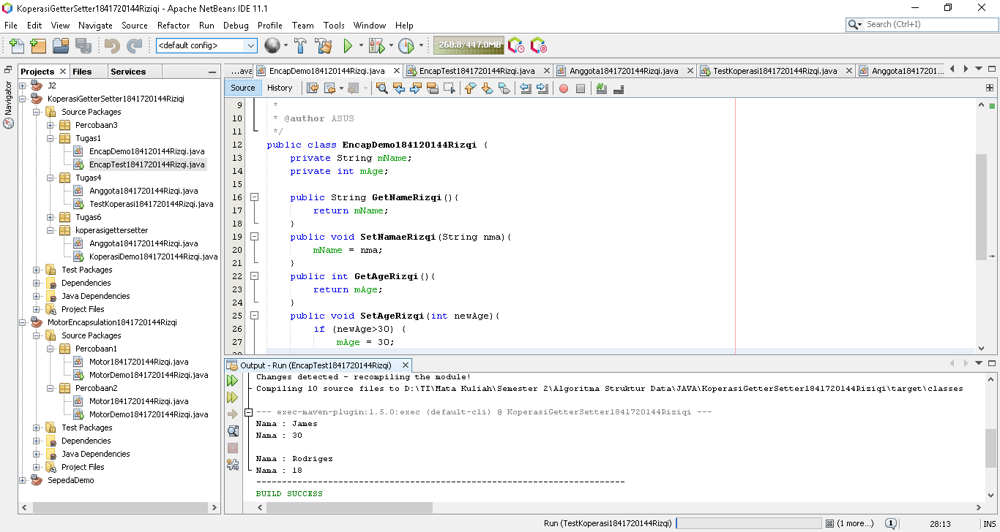

# Laporan Praktikum #3 - Enkapsulasi

## Kompetensi
Setelah melakukan percobaan pada modul ini, mahasiswa memahami konsep:
1. Konstruktor
2. Akses Modifier
3. Atribut/method pada class
4. Intansiasi atribut/method
5. Setter dan getter
6. Memahami notasi pada UML Class Diagram
---

## Ringkasan Materi
1. Private Attribut
2. Access Modifier
3. Getter dan Setter
4. Konstraktor
---
## Percobaan
### ****Percobaan 1 - Enkapsulasi****

>

`Hasil`
>  
>[Kode program Percobaan 1 Motor1841720144Rizqi.java](../../src/3_Enkapsulasi/Percobaan1/Motor1841720144Rizqi.java)  
[Kode program Percobaan 1 MotorDemo1841720144Rizqi.java](../../src/3_Enkapsulasi/Percobaan1/MotorDemo1841720144Rizqi.java)
***

### ****Percobaan 2 - Access Modifier****

>  
Berdasarkan UML class diagram tersebut maka class Motor terdapat perubahan, yaitu:  
>-  Ubah access modifier kecepatan dan kontakOn menjadi private  
>- Tambahkan method nyalakanMesin, matikanMesin tambahKecepatan, kurangiKecepatan.

`Hasil`
> 
>[Kode program Percobaan  2 Motor1841720144Rizqi.java](../../src/3_Enkapsulasi/Percobaan2/Motor1841720144Rizqi.java)  
[Kode program Percobaan 2  MotorDemo1841720144Rizqi.java](../../src/3_Enkapsulasi/Percobaan2/MotorDemo1841720144Rizqi.java)
***

### ****Pertanyaan****
>1. Pada class TestMobil, saat kita menambah
kecepatan untuk pertama kalinya, mengapa muncul peringatan “Kecepatan tidak bisa bertambah karena Mesin Off!”?  
>`Jawab: `  
Karena dalam program tertulis jika *Mesin dalam keadaan mati* maka tidak bisa melakukan **TambahKecepatan**.  
```
if (mKontakOn == true) {
                mKecepatan += 5;  
        } else {
            System.out.println("Kecepatan tidak bisa bertambah karena mesin Off \n");
        }
```
> 
>2. Mengapat atribut kecepatan dan kontakOn diset private?  
>`Jawab:`  
>Agar kelas lain tidak bisa memanggil attribut tersebut, dan Hanya bisa dipanggil dalam satu kelas yang sama.
>3. Ubah class Motor sehingga kecepatan maksimalnya adalah 100!  
>`Jawab:`  

>[Kode program Pertanyaan  3 Motor1841720144Rizqi.java](../../src/3_Enkapsulasi/Pertanyaan/Motor1841720144Rizqi.java)  
>[Kode program Pertanyaan 3  MotorDemo1841720144Rizqi.java](../../src/3_Enkapsulasi/Pertanyaan/MotorDemo1841720144Rizqi.java)  

***

### ****Percobaan 3 - Getter dan Setter****
>

`Hasil`

>
>[Kode program Percobaan 3  Anggota1841720144Rizqi.java](../../src/3_Enkapsulasi/Percobaan3/Anggota1841720144Rizqi.java)  
>[Kode program Percobaan 3  KoperasiDemo1841720144Rizqi.java](../../src/3_Enkapsulasi/Percobaan3/KoperasiDemo1841720144Rizqi.java)
***
### ****Percobaan 4 - Konstruktor, Instansiasi****

>  
>  
>Buat program menggunakan Konstruktor, Instansiasi berdasarkan UML diatas!

`Hasil`
> 
>[Kode program Percobaan 4  Anggota1841720144Rizqi.java](../../src/3_Enkapsulasi/Percobaan4/Anggota1841720144Rizqi.java)   
>[Kode program Percobaan 4  KoperasiDemo1841720144Rizqi.java](../../src/3_Enkapsulasi/Percobaan4/KoperasiDemo1841720144Rizqi.java)
***
### ****Pertanyaan – Percobaan 3 dan 4****
>1. Apa yang dimaksud getter dan setter?  
>`Jawab: `
>- Getter adalah public method dan memiliki tipe data return, yang berfungsi untuk mendapatkan nilai dari atribut private.  
>- Setter adalah public method yang tidak memliki tipe data return, yang berfungsi untuk memanipulasi nilai dari atribut private.

>2. Apa kegunaan dari method getSimpanan()?  
>`Jawab: `  
Untuk mendapatkan nilai dari Atribut Simpanan.

>3. Method apa yang digunakan untuk menambah saldo?  
>`Jawab: `   
Method yang digunakan untuk menambah saldo di program diatas ialah Pinjam : `PinjamRizqi();`.

>4. Apa yand dimaksud konstruktor?  
>`Jawab: `  
Konstruktor mirip dengan method cara deklarasinya akan tetapi tidak *memiliki tipe return*. Dan konstruktor dieksekusi ketika instan dari objek dibuat. Jadi setiap kali sebuat objek dibuat dengan keyword **new()** maka konstruktor akan dieksekusi. 

>5. Sebutkan aturan dalam membuat konstruktor?  
>`Jawab: `   
>- **Nama konstruktor harus sama dengan nama class.**
>-  Konstruktor tidak memiliki tipe data method.
>- Konstruktor hanya jalan saat proses instansiasi.
>-  Selalu memiliki modifier access public.
>- Tidak bisa memiliki return.


>6. Apakah boleh konstruktor bertipe private?  
>`Jawab: `  
>Di java kita dapat memiliki konstruktor dengan modifier private, protected, public or default.

>7. Kapan menggunakan parameter dengan passing parameter?  
>`Jawab: `  
Setelah menambah konstruktor pada class Anggota maka Atribut nama dan alamat secara otomatis harus diset terlebih dahulu dengan melakukan passing parameter jika melakukan instansiasi class Anggota.

>8. Apa perbedaan atribut class dan instansiasi atribut?  
>`Jawab: `  
>- **Instansiasi atribut.** 
>   - Atribut yang dimiliki oleh objek hasil instansiasi.
>   - Untuk akses atribut, sebelumnya harus membuat objek terlebih dahulu.  
>- **Class atribut.**  
>   - atribut dimiliki oleh Class.
>   - atribut class dideklarasikan menggunakan kata kunci **static**.

>9. Apa perbedaan class method dan instansiasi method?  
>`Jawab: `   
>- **Instansiasi method.** 
>   - Atribut yang dimiliki oleh objek hasil instansiasi.
>   - Untuk akses, method sebelumnya harus membuat objek terlebih dahulu.  
>- **Class method.**  
>   - method dimiliki oleh Class.
>   - method class dideklarasikan menggunakan kata kunci **static**.
***

### ****Tugas****
>1. Cobalah program dibawah ini dan tuliskan hasil outputnya  
>

`Hasil`  
>
[Kode program Tugas 1  EncapDemo184120144Rizqi.java](../../src/3_Enkapsulasi/Tugas1/EncapDemo184120144Rizqi.java)  
[Kode program Tugas 1  EncapTest1841720144Rizqi.java](../../src/3_Enkapsulasi/Tugas1/EncapTest1841720144Rizqi.java) 
***

>2. Pada program diatas, pada class EncapTest kita mengeset age dengan nilai 35, namun pada saat ditampilkan ke layar nilainya 30, jelaskan mengapa.

`Jawab: `  
>Karena pada kelas EncapDemo **SetAge** menunjukkan jika newAge lebih dari 30 maka age akan di set menjadi 30.  
``` 
        if (newAge>30) {
            mAge = 30;
            
        }
```
***

>3. Ubah program diatas agar atribut age dapat diberi nilai maksimal 30 dan minimal 18!  

`Hasil`
>  
>[Kode program Tugas 3  EncapDemo184120144Rizqi.java](../../src/3_Enkapsulasi/Tugas3/EncapDemo184120144Rizqi.java)  
[Kode program Tugas 3  EncapTest1841720144Rizqi.java](../../src/3_Enkapsulasi/Tugas3/EncapTest1841720144Rizqi.java)
*** 
>4. Pada sebuah sistem informasi koperasi simpan pinjam, terdapat class Anggota yang memiliki atribut antara lain nomor KTP, nama, limit peminjaman, dan jumlah pinjaman. Anggota dapat meminjam uang dengan batas limit peminjaman yang ditentukan. Anggota juga dapat mengangsur pinjaman. Ketika Anggota tersebut mengangsur pinjaman, maka jumlah pinjaman akan berkurang sesuai dengan nominal yang diangsur. Buatlah class Anggota tersebut, berikan atribut, method dan konstruktor sesuai dengan kebutuhan. Uji dengan TestKoperasi berikut ini untuk memeriksa apakah class Anggota yang anda buat telah sesuai dengan yang diharapkan.  
>  
>  

`Hasil`
>  
>[Kode program Tugas 4  Anggota1841720144Rizqi.java](../../src/3_Enkapsulasi/Tugas4/Anggota1841720144Rizqi.java)  
[Kode program Tugas 4  TestKoperasi1841720144Rizqi.java](../../src/3_Enkapsulasi/Tugas4/TestKoperasi1841720144Rizqi.java)
***

>5. Modifikasi soal no. 4 agar nominal yang dapat diangsur minimal adalah 10% dari jumlah pinjaman saat ini. Jika mengangsur kurang dari itu, maka muncul peringatan “Maaf, angsuran harus 10% dari jumlah pinjaman”.

`Hasil`
>  
>[Kode program Tugas 5  Anggota1841720144Rizqi.java](../../src/3_Enkapsulasi/Tugas5/Anggota1841720144Rizqi.java)  
[Kode program Tugas 5  TestKoperasi1841720144Rizqi.java](../../src/3_Enkapsulasi/Tugas5/TestKoperasi1841720144Rizqi.java)
***
>6. Modifikasi class TestKoperasi, agar jumlah pinjaman dan angsuran dapat menerima input dari console.  

`Hasil`
>  
>[Kode program Tugas 6  Anggota1841720144Rizqi.java](../../src/3_Enkapsulasi/Tugas6/Anggota1841720144Rizqi.java)  
[Kode program Tugas 6  TestKoperasi1841720144Rizqi.java](../../src/3_Enkapsulasi/Tugas6/TestKoperasi1841720144Rizqi.java)
***

## Kesimpulan

- Dapat Mengimplementasikan  Encapsulasi.
- Melakukan Modifier.
- Mengimplementasikan Setter dan Getter.
- Dapat membuat Konstraktor,Instansiasi dan Mengimplementasikannya.

***


## Pernyataan Diri

Saya menyatakan isi tugas, kode program, dan laporan praktikum ini dibuat oleh saya sendiri. Saya tidak melakukan plagiasi, kecurangan, menyalin/menggandakan milik orang lain.

Jika saya melakukan plagiasi, kecurangan, atau melanggar hak kekayaan intelektual, saya siap untuk mendapat sanksi atau hukuman sesuai peraturan perundang-undangan yang berlaku.

Ttd,

***(Muhammad Rizqi Mahendra)***


