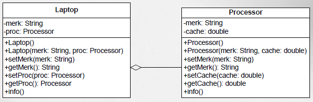
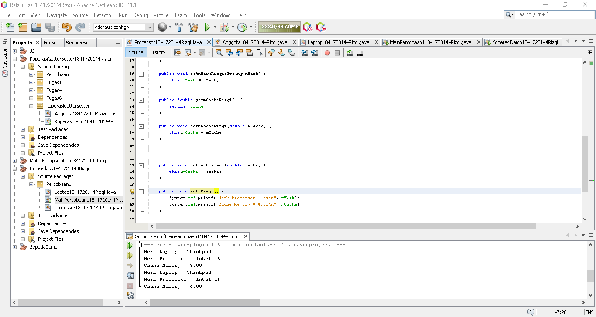
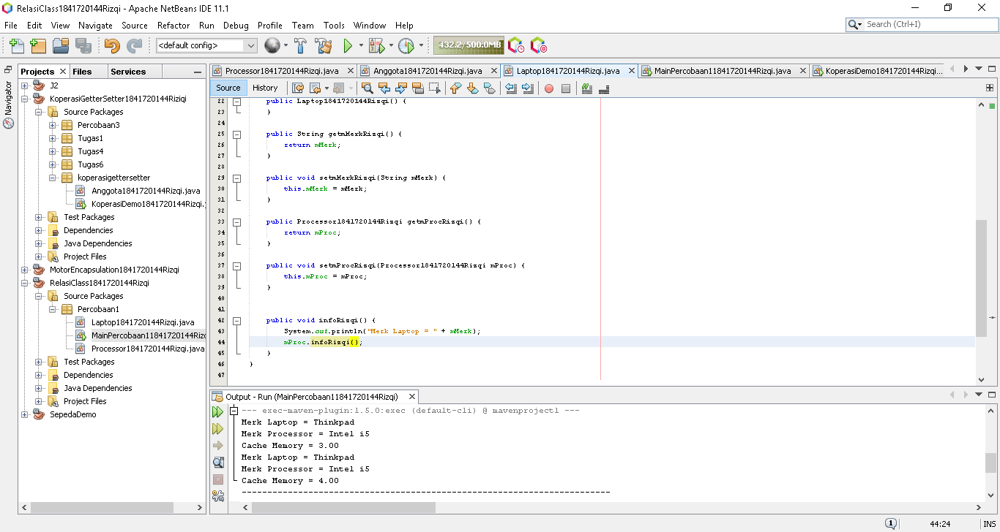
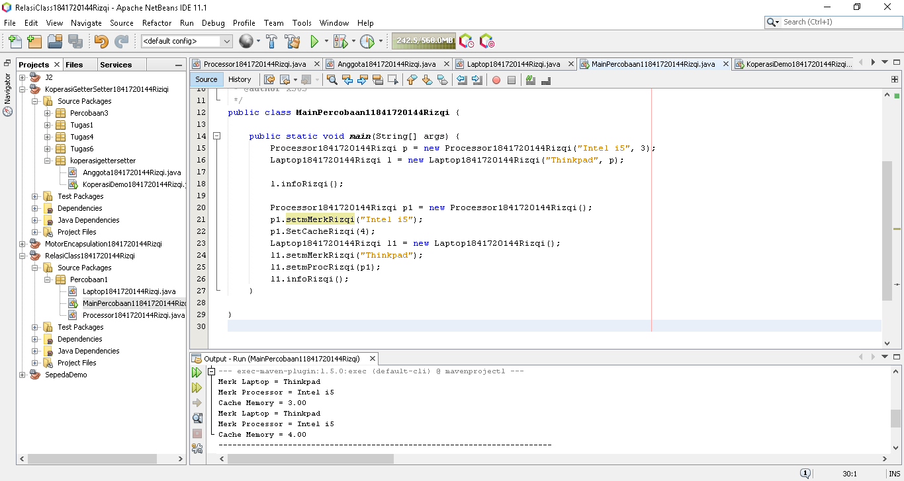
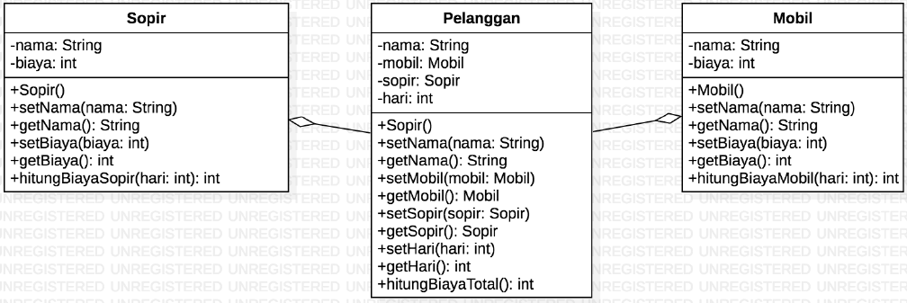
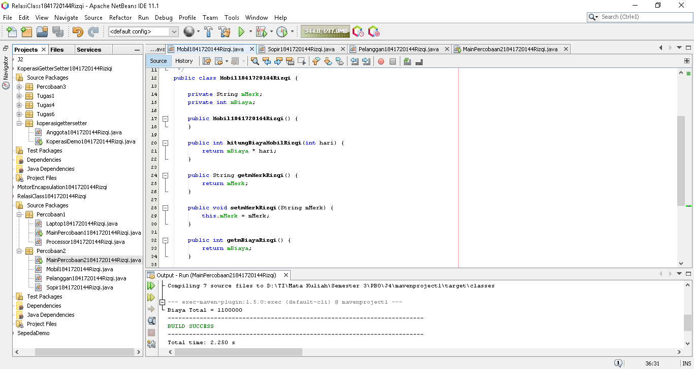
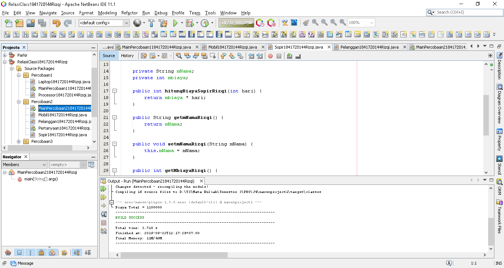
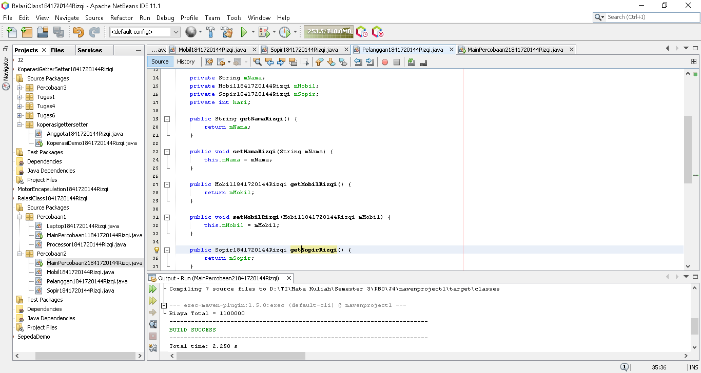
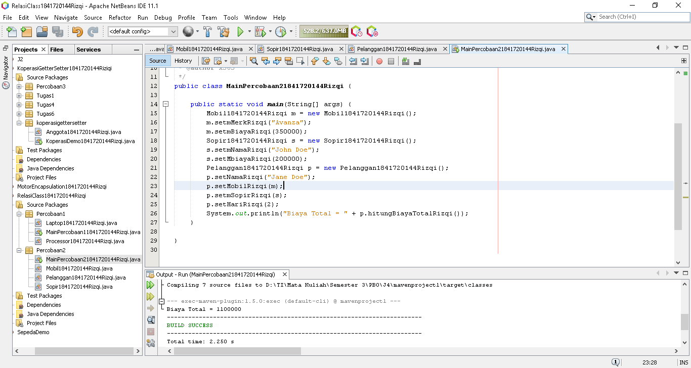
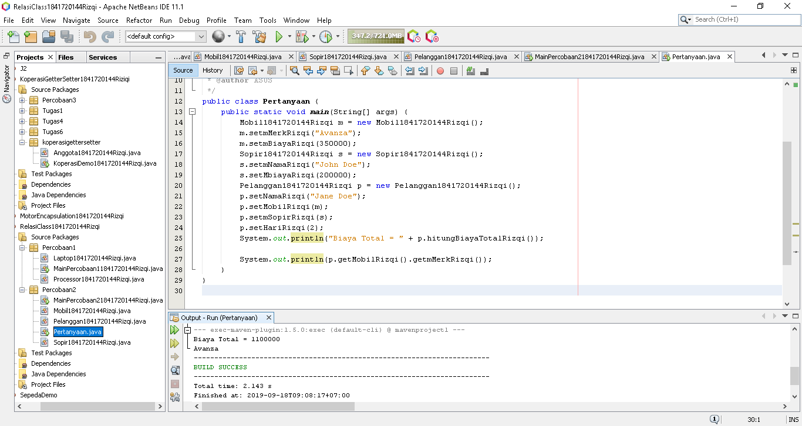

# Laporan Praktikum #4 - Relasi Class
***
## Kompetensi
Setelah menempuh pokok bahasan ini, mahasiswa mampu:
1. Memahami konsep relasi kelas;
2. Mengimplementasikan relasi has‑a dalam program.
---

## Ringkasan Materi
1. Relasiclass 
2. multiplicity
---
***

## Praktikum
---
### Percobaan 1

>

`hasil`
>
>
>[Kode program Percobaan 1 Processor1841720144Rizqi.java](../../src/4_Relasi_Class/Percobaan1/Processor1841720144Rizqi.java)
>
>
>
>[Kode program Percobaan 1 Laptop1841720144Rizqi.java](../../src/4_Relasi_Class/Percobaan1/Laptop1841720144Rizqi.java)
>
>
>
>[Kode Program MainPercobaan11841720144Rizqi.java](../../src/4_Relasi_Class/Percobaan1/MainPercobaan11841720144Rizqi.java)
>
***

### Pertanyaan Percobaan 1

1. Di dalam class Processor dan class Laptop , terdapat method setter dan getter untuk masing‑masing atributnya. Apakah gunanya method setter dan getter tersebut ?  
`Jawab`
>Getter dan setter digunakan untuk menentukan nilai dari atribut dan untuk memanggil nilai tersebut. atau lebih jelasnya **setter** untuk menentukan nilai dari atribut. sedangkan **getter** untuk memanggil nilai atribut yang telah di tentukan.
---
2. Di dalam class Processor dan class Laptop, masing‑masing terdapat konstruktor default dan konstruktor berparameter. Bagaimanakah beda penggunaan dari kedua jenis konstruktor tersebut ?  
`Jawab`
>Konstraktor default digunakan setelah instansiasi class
>```
>Processor1841720144Rizqi p1 = new Processor1841720144Rizqi();
>        p1.setmMerkRizqi("Intel i5");
>        p1.SetCacheRizqi(4);
>        Laptop1841720144Rizqi l1 = new Laptop1841720144Rizqi();
>        l1.setmMerkRizqi("Thinkpad");
>        l1.setmProcRizqi(p1);
>```
>Konstraktor parameter digunakan saat instansiasi class dengan cara diset terlebih dahulu dengan melakukan passing parameter.
>```
>Processor1841720144Rizqi p = new Processor1841720144Rizqi("Intel i5", 3);
>Laptop1841720144Rizqi l = new Laptop1841720144Rizqi("Thinkpad", p);
>```
>
---
3. Perhatikan class Laptop, di antara 2 atribut yang dimiliki (merk dan proc), atribut manakah yang bertipe object ?  
`Jawab`
>Atribut yang bertipe objek merupakan proc. proc merupakan objek dari kelas **Processor1841720144Rizqi**.
---
4. Perhatikan class Laptop, pada baris manakah yang menunjukan bahwa class Laptop memiliki relasi dengan class Processor ?  
`Jawab`
>baris ke-15
>```
>private Processor1841720144Rizqi mProc;
>```
>baris ke-17
>```
>public Laptop1841720144Rizqi(String merk, Processor1841720144Rizqi proc)
>```
>baris ke-34
>```
> public Processor1841720144Rizqi getmProcRizqi()
>```
>baris ke-38
>```
>public void setmProcRizqi(Processor1841720144Rizqi mProc)
>```
>
---

5. Perhatikan pada class Laptop , Apakah guna dari sintaks proc.info() ?  
`Jawab`    
>untuk memanggil methode info pada kelas prosessor
---

6. Pada class MainPercobaan1, terdapat baris kode:  
```
Laptop l = new Laptop("Thinkpad", p);
```  
- Apakah p tersebut ?
Dan apakah yang terjadi jika baris kode tersebut diubah menjadi:  
```
Laptop l = new Laptop("Thinkpad", new Processor("Intel i5", 3));
```  
- Bagaimanakah hasil program saat dijalankan, apakah ada perubahan ?
  
`Jawab`  
>- p merupakan instansiasi dari class prosessor.  
>- Sama saja.
---
***
### Percobaan 2

>

`Hasil`
>  
>
>[Kode Program Mobil1841720144Rizqi.java](../../src/4_Relasi_Class/Percobaan2/Mobil1841720144Rizqi.java)
>
>
>
>[Kode Program Sopir1841720144Rizqi.java](../../src/4_Relasi_Class/Percobaan2/Sopir1841720144Rizqi.java)
>
>
>
>[Kode Program Pelanggan1841720144Rizqi.java](../../src/4_Relasi_Class/Percobaan2/Pelanggan1841720144Rizqi.java)     
>
>
>
>[Kode Program MainPercobaan21841720144Rizqi.java](../../src/4_Relasi_Class/Percobaan2/MainPercobaan21841720144Rizqi.java)    
>
***

### Pertanyaan Percobaan 2
1. Perhatikan class Pelanggan. Pada baris program manakah yang menunjukan bahwa class Pelanggan memiliki relasi dengan class Mobil dan class Sopir ?   
`Jawab`  
>baris ke-15,16
>```
>private Mobil1841720144Rizqi mMobil;
>private Sopir1841720144Rizqi mSopir;
>```
>baris ke-52
>```
>return mMobil.hitungBiayaMobilRizqi(hari) + mSopir.hitungBiayaSopirRizqi(hari);
>```
>
***
2. Perhatikan method hitungBiayaSopir pada class Sopir, serta method hitungBiayaMobil pada class Mobil. Mengapa menurut Anda method tersebut harus memiliki argument hari ?  
`Jawab`  
>Karena biaya sewa sopir maupun mobil dihitung per hari.
***
3. Perhatikan kode dari class Pelanggan. Untuk apakah perintah mobil.hitungBiayaMobil(hari) dan sopir.hitungBiayaSopir(hari) ?  
`Jawab`  
>untuk menghitung biaya total yang di terima oleh pelanggan. dimana biaya dari sewa mobil dijumlah dengan biaya sewa sopir sehingga akan menghasilkan total biaya yang harus di bayar oleh pelanggan.
***
4. Perhatikan class MainPercobaan2. Untuk apakah sintaks p.setMobil(m) dan p.setSopir(s) ?  
`Jawab`  
>untuk mengeset atribut yang telah di inputkan melalui variabel m dan s.
***
5. Perhatikan class MainPercobaan2. Untuk apakah proses p.hitungBiayaTotal() tersebut ?  
`Jawab`  
>untuk memanggil methode hitungbiayatotal pada kelas pelanggan.
***
6. Perhatikan class MainPercobaan2, coba tambahkan pada baris terakhir dari method main dan amati perubahan saat di‑run!
```
System.out.println(p.getMobil().getMerk());
```
Jadi untuk apakah sintaks p.getMobil().getMerk() yang ada di dalam method main tersebut?  
`Jawab`  
>  
>
>[Kode Program Pertanyaan1841720144Rizqi.java](../../src/4_Relasi_Class/Percobaan2/Pertanyaan1841720144Rizqi.java)
>
>Jadi sintaks tersebut digunakan untuk menampilkan atribut merek pada kelas mobil.
***
### Percobaan 3


