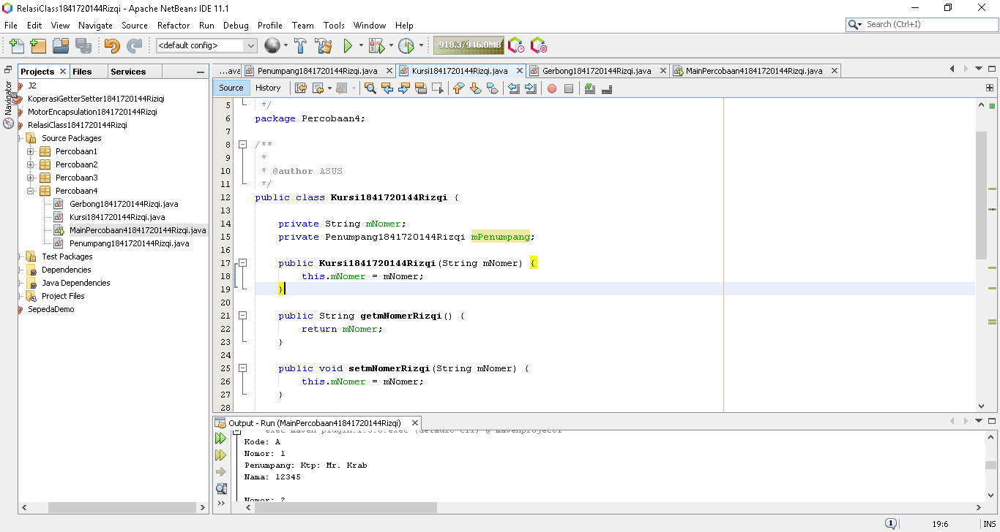

# Laporan Praktikum #4 - Relasi Class
***
## Kompetensi
Setelah menempuh pokok bahasan ini, mahasiswa mampu:
1. Memahami konsep relasi kelas;
2. Mengimplementasikan relasi has‑a dalam program.
---

## Ringkasan Materi
1. Relasiclass 
2. multiplicity
---
***

## Praktikum
---
### Percobaan 1

>

`hasil`
>
>
>[Kode program Percobaan 1 Processor1841720144Rizqi.java](../../src/4_Relasi_Class/Percobaan1/Processor1841720144Rizqi.java)
>
>
>
>[Kode program Percobaan 1 Laptop1841720144Rizqi.java](../../src/4_Relasi_Class/Percobaan1/Laptop1841720144Rizqi.java)
>
>
>
>[Kode Program MainPercobaan11841720144Rizqi.java](../../src/4_Relasi_Class/Percobaan1/MainPercobaan11841720144Rizqi.java)
>
***

### Pertanyaan Percobaan 1

1. Di dalam class Processor dan class Laptop , terdapat method setter dan getter untuk masing‑masing atributnya. Apakah gunanya method setter dan getter tersebut ?  
`Jawab`
>Getter dan setter digunakan untuk menentukan nilai dari atribut dan untuk memanggil nilai tersebut. atau lebih jelasnya **setter** untuk menentukan nilai dari atribut. sedangkan **getter** untuk memanggil nilai atribut yang telah di tentukan.
---
2. Di dalam class Processor dan class Laptop, masing‑masing terdapat konstruktor default dan konstruktor berparameter. Bagaimanakah beda penggunaan dari kedua jenis konstruktor tersebut ?  
`Jawab`
>Konstraktor default digunakan setelah instansiasi class
>```
>Processor1841720144Rizqi p1 = new Processor1841720144Rizqi();
>        p1.setmMerkRizqi("Intel i5");
>        p1.SetCacheRizqi(4);
>        Laptop1841720144Rizqi l1 = new Laptop1841720144Rizqi();
>        l1.setmMerkRizqi("Thinkpad");
>        l1.setmProcRizqi(p1);
>```
>Konstraktor parameter digunakan saat instansiasi class dengan cara diset terlebih dahulu dengan melakukan passing parameter.
>```
>Processor1841720144Rizqi p = new Processor1841720144Rizqi("Intel i5", 3);
>Laptop1841720144Rizqi l = new Laptop1841720144Rizqi("Thinkpad", p);
>```
>
---
3. Perhatikan class Laptop, di antara 2 atribut yang dimiliki (merk dan proc), atribut manakah yang bertipe object ?  
`Jawab`
>Atribut yang bertipe objek merupakan proc. proc merupakan objek dari kelas **Processor1841720144Rizqi**.
---
4. Perhatikan class Laptop, pada baris manakah yang menunjukan bahwa class Laptop memiliki relasi dengan class Processor ?  
`Jawab`
>baris ke-15
>```
>private Processor1841720144Rizqi mProc;
>```
>baris ke-17
>```
>public Laptop1841720144Rizqi(String merk, Processor1841720144Rizqi proc)
>```
>baris ke-34
>```
> public Processor1841720144Rizqi getmProcRizqi()
>```
>baris ke-38
>```
>public void setmProcRizqi(Processor1841720144Rizqi mProc)
>```
>
---

5. Perhatikan pada class Laptop , Apakah guna dari sintaks proc.info() ?  
`Jawab`    
>untuk memanggil methode info pada kelas prosessor
---

6. Pada class MainPercobaan1, terdapat baris kode:  
```
Laptop l = new Laptop("Thinkpad", p);
```  
- Apakah p tersebut ?
Dan apakah yang terjadi jika baris kode tersebut diubah menjadi:  
```
Laptop l = new Laptop("Thinkpad", new Processor("Intel i5", 3));
```  
- Bagaimanakah hasil program saat dijalankan, apakah ada perubahan ?
  
`Jawab`  
>- p merupakan instansiasi dari class prosessor.  
>- Sama saja.
---
***
### Percobaan 2

>

`Hasil`
>  
>
>[Kode Program Mobil1841720144Rizqi.java](../../src/4_Relasi_Class/Percobaan2/Mobil1841720144Rizqi.java)
>
>
>
>[Kode Program Sopir1841720144Rizqi.java](../../src/4_Relasi_Class/Percobaan2/Sopir1841720144Rizqi.java)
>
>
>
>[Kode Program Pelanggan1841720144Rizqi.java](../../src/4_Relasi_Class/Percobaan2/Pelanggan1841720144Rizqi.java)     
>
>
>
>[Kode Program MainPercobaan21841720144Rizqi.java](../../src/4_Relasi_Class/Percobaan2/MainPercobaan21841720144Rizqi.java)    
>
***

### Pertanyaan Percobaan 2
1. Perhatikan class Pelanggan. Pada baris program manakah yang menunjukan bahwa class Pelanggan memiliki relasi dengan class Mobil dan class Sopir ?   
`Jawab`  
>baris ke-15,16
>```
>private Mobil1841720144Rizqi mMobil;
>private Sopir1841720144Rizqi mSopir;
>```
>baris ke-52
>```
>return mMobil.hitungBiayaMobilRizqi(hari) + mSopir.hitungBiayaSopirRizqi(hari);
>```
>
***
2. Perhatikan method hitungBiayaSopir pada class Sopir, serta method hitungBiayaMobil pada class Mobil. Mengapa menurut Anda method tersebut harus memiliki argument hari ?  
`Jawab`  
>Karena biaya sewa sopir maupun mobil dihitung per hari.
***
3. Perhatikan kode dari class Pelanggan. Untuk apakah perintah mobil.hitungBiayaMobil(hari) dan sopir.hitungBiayaSopir(hari) ?  
`Jawab`  
>untuk menghitung biaya total yang di terima oleh pelanggan. dimana biaya dari sewa mobil dijumlah dengan biaya sewa sopir sehingga akan menghasilkan total biaya yang harus di bayar oleh pelanggan.
***
4. Perhatikan class MainPercobaan2. Untuk apakah sintaks p.setMobil(m) dan p.setSopir(s) ?  
`Jawab`  
>untuk mengeset atribut yang telah di inputkan melalui variabel m dan s.
***
5. Perhatikan class MainPercobaan2. Untuk apakah proses p.hitungBiayaTotal() tersebut ?  
`Jawab`  
>untuk memanggil methode hitungbiayatotal pada kelas pelanggan.
***
6. Perhatikan class MainPercobaan2, coba tambahkan pada baris terakhir dari method main dan amati perubahan saat di‑run!
```
System.out.println(p.getMobil().getMerk());
```
Jadi untuk apakah sintaks p.getMobil().getMerk() yang ada di dalam method main tersebut?  
`Jawab`  
>  
>
>[Kode Program Pertanyaan1841720144Rizqi.java](../../src/4_Relasi_Class/Percobaan2/Pertanyaan1841720144Rizqi.java)
>
>Jadi sintaks tersebut digunakan untuk menampilkan atribut merek pada kelas mobil.
***
### Percobaan 3
>  
`Hasil`  
>
>
>[Kode Program Pegawai1841720144Rizqi.java](../../src/4_Relasi_Class/Percobaan3/Pegawai1841720144Rizqi.java)
>  
>  
>[Kode Program KeretaApi1841720144Rizqi.java](../../src/4_Relasi_Class/Percobaan3/KeretaApi1841720144Rizqi.java)
>
>  
>
>[Kode Program MainPercobaan31841720144Rizqi.java](../../src/4_Relasi_Class/Percobaan3/MainPercobaan31841720144Rizqi.java)

***
### Pertanyaan Percobaan 3
1. Di dalam method info() pada class KeretaApi, baris this.masinis.info() dan this.asisten.info() digunakan untuk apa ?  
`Jawab`  
>untuk menampilkan nilai pada atribut masinis dan asisten.
---
2. Buatlah main program baru dengan nama class MainPertanyaan pada package yang sama. Tambahkan kode berikut pada method main() !
```
Pegawai masinis = new Pegawai("1234", "Spongebob Squarepants");
KeretaApi keretaApi = new KeretaApi("Gaya Baru", "Bisnis", masinis);
System.out.println(keretaApi.info());
```
`Hasil`
>
---
3. Apa hasil output dari main program tersebut ? Mengapa hal tersebut dapat terjadi ?  
`Jawab`  
>Hasilnya error, karena atribut asisten pada methode info tidak dideklarasikan. senhingga program error.
---
4. Perbaiki class KeretaApi sehingga program dapat berjalan !  
`Jawab`  
>
>
>[Kode Program KeretaApi21841720144Rizqi.java](../../src/4_Relasi_Class/Percobaan3/KeretaApi21841720144Rizqi.java)
>
>
>
>[Kode Program MainPertanyaan1841720144Rizqi.java](../../src/4_Relasi_Class/Percobaan3/MainPertanyaan1841720144Rizqi.java)
***
### Percobaan 4

>

`Hasil`
>
>
>[Kode Program Penumpang1841720144Rizqi.java](../../src/4_Relasi_Class/Percobaan4/Penumpang1841720144Rizqi.java)
>
>
>
>[Kode Program Kursi1841720144Rizqi.java](../../src/4_Relasi_Class/Percobaan4/Kursi1841720144Rizqi.java)
>
>
>
>[Kode Program Gerbong1841720144Rizqi.java](../../src/4_Relasi_Class/Percobaan4/Gerbong1841720144Rizqi.java)
>
>
>
>[Kode Program MainPercobaan41841720144Rizqi.java](../../src/4_Relasi_Class/Percobaan4/MainPercobaan41841720144Rizqi.java)

***
### Pertanyaan Percobaan 4

1. Pada main program dalam class MainPercobaan4, berapakah jumlah kursi dalam Gerbong A ?  
`Jawab`  
>Dalam Gerbong A terdapat 10 kursi dimana 
Kursi nomor 1 telah terisi sementara kursi nomer 2 - 10 dalam keadaan kosong.
***
2. Perhatikan potongan kode pada method info() dalam class Kursi. Apa maksud kode tersebut ?
```
if (this.penumpang != null) {
info += "Penumpang: " + penumpang.info() + "\n";
}
```    
`Jawab`
>Jadi jika ada penumpang maka penumpang maka akan dijadikan output.
***
3. Mengapa pada method setPenumpang() dalam class Gerbong, nilai nomor dikurangi dengan angka 1 ?  
`Jawab `  
>Karena looping pada init kursi dimulai dari 0.
***
4. Instansiasi objek baru budi dengan tipe Penumpang, kemudian masukkan objek baru tersebut pada gerbong dengan gerbong.setPenumpang(budi, 1). Apakah yang terjadi ?  
`Jawab`
>Kursi 1 yang sebelum nya mr.krab akan direplace dengan budi.
>
***
5. Modifikasi program sehingga tidak diperkenankan untuk menduduki kursi yang sudah ada penumpang lain !  
`Jawab`
>
>
>[Kode Program gerbong21841720144Rizqi.java](../../src/4_Relasi_Class/Percobaan4/gerbong21841720144Rizqi.java)  
>
>
>
>[Kode Program Pertanyaan1841720144Rizqi.java](../../src/4_Relasi_Class/Percobaan4/Pertanyaan1841720144Rizqi.java)
>
***

### TUGAS
Buatlah sebuah studi kasus, rancang dengan class diagram, kemudian implementasikan ke dalam program! Studi kasus harus mewakili relasi class dari percobaan‑percobaan yang telah dilakukan pada materi ini, setidaknya melibatkan minimal 4 class (class yang berisi main tidak dihitung).

>
>
>[Kode Program Mobil1841720144Rizqi.java](../../src/4_Relasi_Class/Tugas/Mobil1841720144Rizqi.java)
>
>
>
>[Kode Program Pengunjung1841720144Rizqi.java](../../src/4_Relasi_Class/Tugas/Pengunjung1841720144Rizqi.java)
>
>
>
>[Kode Program SlotParkir1841720144Rizqi.java](../../src/4_Relasi_Class/Tugas/SlotParkir1841720144Rizqi.java)
>
>
>
>[Kode Program Parkir1841720144Rizqi.java](../../src/4_Relasi_Class/Tugas/Parkir1841720144Rizqi.java)
>
>
>
>[Kode Program Main1841720144Rizqi.java](../../src/4_Relasi_Class/Tugas/Main1841720144Rizqi.java)
***

## Kesimpulan

- Dapat Mengimplementasikan  Encapsulasi.
- Melakukan Modifier.
- Mengimplementasikan Setter dan Getter.
- Dapat membuat Konstraktor,Instansiasi dan Mengimplementasikannya.

***


## Pernyataan Diri

Saya menyatakan isi tugas, kode program, dan laporan praktikum ini dibuat oleh saya sendiri. Saya tidak melakukan plagiasi, kecurangan, menyalin/menggandakan milik orang lain.

Jika saya melakukan plagiasi, kecurangan, atau melanggar hak kekayaan intelektual, saya siap untuk mendapat sanksi atau hukuman sesuai peraturan perundang-undangan yang berlaku.

Ttd,

***(Muhammad Rizqi Mahendra)***


