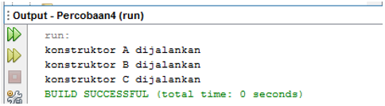
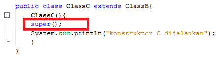

# Laporan Praktikum #6 - INHERITANCE (PEWARISAN)

## Kompetensi

1. Memahami konsep dasar inheritance atau pewarisan.
2. Mampu membuat suatu subclass dari suatu superclass tertentu.
3. Mampu mengimplementasikan konsep single dan multilevel inheritance.
4. Mampu membuat objek dari suatu subclass dan melakukan pengaksesan terhadap atribut dan method baik yang dimiliki sendiri atau turunan dari superclass nya.

***
## Ringkasan Materi
1. Extends
2. Hak Akses
3. Super
4. Super contsructor
5. Single Inheritance
6. Multilevel inheritance
***
## Percobaan
### Percobaan 1 - Extends
>  
>
>
>
>
>
>[Kode program Percobaan 1 ClassA1841720144Rizqi.java](../../src/6_Inheritance/Percobaan1/ClassA1841720144Rizqi.java)  
>[Kode program Percobaan 1 ClassB1841720144Rizqi.java](../../src/6_Inheritance/Percobaan1/ClassB1841720144Rizqi.java)  
>[Kode program Percobaan 1 Percobaan11841720144Rizqi.java](../../src/6_Inheritance/Percobaan1/Percobaan11841720144Rizqi.java)  
***

#### Pertanyaan 
1.	Pada percobaan 1 diatas program yang dijalankan terjadi error, kemudian perbaiki sehingga program tersebut bisa dijalankan dan tidak error!  
`Jawab`  
>  
>
>
>
>
>
>[Kode program Percobaan 1 Fix ClassA1841720144Rizqi.java](../../src/6_Inheritance/Percobaan1/fixed/ClassA1841720144Rizqi.java)   
>[Kode program Percobaan 1 Fix ClassB1841720144Rizqi.java](../../src/6_Inheritance/Percobaan1/fixed/ClassB1841720144Rizqi.java)   
>[Kode program Percobaan 1 Fix Percobaan11841720144Rizqi.java](../../src/6_Inheritance/Percobaan1/fixed/Percobaan11841720144Rizqi.java)   
***

2.	Jelaskan apa penyebab program pada percobaan 1 ketika dijalankan terdapat error!  
`Jawab`  
    >Karena Program class child B belum ditambahkan syntag extends ke class parent A.

***
### Percobaan 2 - Hak Akses

>  
>
>
>
>
>
>[Kode program Percobaan 2 ClassA1841720144Rizqi.java](../../src/6_Inheritance/Percobaan2/ClassA1841720144Rizqi.java)  
>[Kode program Percobaan 2 ClassB1841720144Rizqi.java](../../src/6_Inheritance/Percobaan2/ClassB1841720144Rizqi.java)  
>[Kode program Percobaan 2 Percobaan21841720144Rizqi.java](../../src/6_Inheritance/Percobaan2/Percobaan21841720144Rizqi.java)
***  
#### Pertanyaan 
1.	Pada percobaan 2 diatas program yang dijalankan terjadi error, kemudian perbaiki sehingga program tersebut bisa dijalankan dan tidak error!   
`Jawab`  
>  
>
>
>
>
>
>[Kode program Percobaan 2 fix ClassA1841720144Rizqi.java](../../src/6_Inheritance/Percobaan2/fixed/ClassA1841720144Rizqi.java)  
>[Kode program Percobaan 2 fix ClassB1841720144Rizqi.java](../../src/6_Inheritance/Percobaan2/fixed/ClassB1841720144Rizqi.java)  
>[Kode program Percobaan 2 fix Percobaan21841720144Rizqi.java](../../src/6_Inheritance/Percobaan2/fixed/Percobaan21841720144Rizqi.java) 
***
2.	Jelaskan apa penyebab program pada percobaan 2 ketika dijalankan terdapat error!  
`Jawab`  
    >Karena Program class child B belum ditambahkan syntag extends ke class parent A dan modifiernya private, dimana private hanya bisa diakses jika satu class dan tidak bisa diakses di kelas lain.
### Percobaan 3 - Super
>  
>
>
>
>
>
>[Kode program Percobaan 3 Bangun1841720144Rizqi.java](../../src/6_Inheritance/Percobaan3/Bangun1841720144Rizqi.java)  
[Kode program Percobaan 3 Tabung1841720144Rizqi.java](../../src/6_Inheritance/Percobaan3/Tabung1841720144Rizqi.java)  
[Kode program Percobaan 3 Percobaan31841720144Rizqi.java](../../src/6_Inheritance/Percobaan3/Percobaan31841720144Rizqi.java)  
***
#### Pertanyaan 
1. Jelaskan fungsi “super” pada potongan program berikut di class Tabung!    
  
`Jawab`  
    >Super tersebut berfungsi untuk memanggil atribut dari class parent. dimana atribut phi dan r tersebut berorientasi pada phi dan r pada class paarent.
***    
2. Jelaskan fungsi “super” dan “this” pada potongan program berikut di class Tabung!  
   
`Jawab`  
    >super untuk memanggil atribut pada class parent dan this untuk memanggil atribut yang telah ditentukan untuk menghindari dari penamaan atribut yang sama.
    dalam program diatas **phi dan r** berorieantasi pada atribut class parent jadi **phi dan r** menggunakan super, sedangkan **t** menggunakan this untuk memanggil atribut **t**  yang telah ditentukan sebelumnya.
***
3.	Jelaskan mengapa pada class Tabung tidak dideklarasikan atribut “phi” dan “r” tetapi class tersebut dapat mengakses atribut tersebut!  
`Jawab`  
    >karena class tabung merupakan turunan dari class bangun oleh karenanya class tabung bisa memanggil atribut dari class bangun dengan cara menggunakan **super**

***

### Percobaan 4 - super contsructor
>  
>
>
>
>
>
>
>
>[Kode program Percobaan 4 ClassA1841720144Rizqi.java](../../src/6_Inheritance/Percobaan4/ClassA1841720144Rizqi.java)  
>[Kode program Percobaan 4 ClassB1841720144Rizqi.java](../../src/6_Inheritance/Percobaan4/ClassB1841720144Rizqi.java)  
>[Kode program Percobaan 4 ClassC1841720144Rizqi.java](../../src/6_Inheritance/Percobaan4/ClassC1841720144Rizqi.java)  
>[Kode program Percobaan 4 Percobaan41841720144Rizqi.java](../../src/6_Inheritance/Percobaan4/Percobaan41841720144Rizqi.java)
***  
#### Pertanyaan 
1.	Pada percobaan 4 sebutkan mana class yang termasuk superclass dan subclass, kemudian jelaskan alasannya!  
`Jawab`  
    >ClassA = Superclass dari classB  
    >ClassB = SubClass dari classA  
    >ClassB = Superclass dari classC      
    >ClassC = SubClass dari classB  

***
2.	Ubahlah isi konstruktor default ClassC seperti berikut:  
  
Tambahkan kata super() di baris Pertaman dalam konstruktor defaultnya. Coba jalankan kembali class Percobaan4 dan terlihat tidak ada perbedaan dari hasil outputnya!    
`Jawab`  
    >

***
3.	Ublah isi konstruktor default ClassC seperti berikut:  
  
Ketika mengubah posisi super() dibaris kedua dalam kontruktor defaultnya dan terlihat ada error. Kemudian kembalikan super() kebaris pertama seperti sebelumnya, maka errornya akan hilang.
Perhatikan hasil keluaran ketika class Percobaan4 dijalankan. Kenapa bisa tampil output seperti berikut pada saat instansiasi objek test dari class ClassC
    
Jelaskan bagaimana urutan proses jalannya konstruktor saat objek test dibuat!  
`Jawab`  
    >  
    >  
    >karena pada constraktor classB terdapat syntag super(); maka constraktor dari superclass akan dipanggil.
    ``` 
    public ClassC1841720144Rizqi() {
        super();
        System.out.println("Konstraktor C dijalankan");
    }
    ```
      
    
***
4.	Apakah fungsi super() pada potongan program dibawah ini di ClassC!  
    
`Jawab`  
    >Untuk memanggil constraktor pada superclass
***
### Percobaan 5
>  
>
>
>
>
>
>
>
>[Kode program Percobaan 5 Karyawan1841720144Rizqi.java](../../src/6_Inheritance/Percobaan5/Karyawan1841720144Rizqi.java)  
>[Kode program Percobaan 5 Manager1841720144Rizqi.java](../../src/6_Inheritance/Percobaan5/Manager1841720144Rizqi.java)   
>[Kode program Percobaan 5 Staff1841720144Rizqi.java](../../src/6_Inheritance/Percobaan5/Staff1841720144Rizqi.java)   
>[Kode program Percobaan 5 inheritance11841720144Rizqi.java](../../src/6_Inheritance/Percobaan5/inheritance11841720144Rizqi.java) 

***
#### Pertanyaan  
1.	Sebutkan class mana yang termasuk super class dan sub class dari percobaan 1 diatas!  
`Jawab`  
    >class karyawan merupakan superclass dari class manager dan staff.  
    >class manager merupakan subclass dari class karyawan.  
    >class staff merupakan subclass dari class karyawan.  
***
2.	Kata kunci apakah yang digunakan untuk menurunkan suatu class ke class yang lain?    
`Jawab` 
    >exstends
***
3.	Perhatikan kode program pada class Manager, atribut apa saja yang dimiliki oleh class tersebut? Sebutkan atribut mana saja yang diwarisi dari class Karyawan!  
`Jawab` 
    >class Manager mempunyai atribut **tunjangan**.
    >atribut **nama,alamat,jk,umur,gaji** merupakan warisan dari class karyawan 
***
4.	Jelaskan kata kunci super pada potongan program dibawah ini yang terdapat pada class Manager!  
  
`Jawab` 
    >super tersebut untuk memanggil atribut gaji pada class parent yaitu class karyawan.   
***
5.	Program pada percobaan 5 diatas termasuk dalam jenis inheritance apa? Jelaskan alasannya!  
`Jawab` 
    >program diatas merupakan jenis Single Inheritance. karena class Manager dan staff tidak memiliki subclass.

***

### Percobaan 6
>  
>
>
>
>
>
>
>
>
>
>
>
>[Kode program Percobaan 6 Karyawan1841720144Rizqi.java](../../src/6_Inheritance/Percobaan6/Karyawan1841720144Rizqi.java)  
>[Kode program Percobaan 6 Manager1841720144Rizqi.java](../../src/6_Inheritance/Percobaan6/Manager1841720144Rizqi.java)  
>[Kode program Percobaan 6 Staff1841720144Rizqi.java](../../src/6_Inheritance/Percobaan6/Staff1841720144Rizqi.java)  
>[Kode program Percobaan 6 StaffTetap1841720144Rizqi.java](../../src/6_Inheritance/Percobaan6/StaffTetap1841720144Rizqi.java)  
>[Kode program Percobaan 6 StaffHarian1841720144Rizqi.java](../../src/6_Inheritance/Percobaan6/StaffHarian1841720144Rizqi.java)  
>[Kode program Percobaan 6 inheritance11841720144Rizqi.java](../../src/6_Inheritance/Percobaan6/inheritance11841720144Rizqi.java)  

***
#### Pertanyaan 
1.	Berdasarkan class diatas manakah yang termasuk single inheritance dan mana yang termasuk multilevel inheritance?    
`Jawab` 
    >- single inheritance :  
    >  class manager karena tidak mempunyai subclass  . 
    >- multilevel inheritance :  
    >  class staff karena mempunyai subclass yaitu class stafTetap dan stafHarian.
***
2.	Perhatikan kode program class StaffTetap dan StaffHarian, atribut apa saja yang dimiliki oleh class tersebut? Sebutkan atribut mana saja yang diwarisi dari class Staff!    
`Jawab` 
    >- class StaffTetap  
    >  golongan dan asuransi.
    >- class StaffHarian  
    >  jmlJamKerja. 
    >- warisan dari class staff
    >  nama,alamat,umur,jk,gaji,lembur,potongan. 

***
3.	Apakah fungsi potongan program berikut pada class StaffHarian   
    
`Jawab`   
    >untuk memanggil consraktor pada superclass/class staff. 
***
4.	Apakah fungsi potongan program berikut pada class StaffHarian    
  
`Jawab` 
    >untuk memanggil metode tampilDataStaff pada superclass/class staff
***
5.	Perhatikan kode program dibawah ini yang terdapat pada class StaffTetap
  
Terlihat dipotongan program diatas atribut gaji, lembur dan potongan dapat diakses langsung. Kenapa hal ini bisa terjadi dan bagaimana class StaffTetap memiliki atribut gaji, lembur, dan potongan padahal dalam class tersebut tidak dideklarasikan atribut gaji, lembur, dan potongan?  
`Jawab` 
    >karena atribut merupakan warisan dari superclass
***
