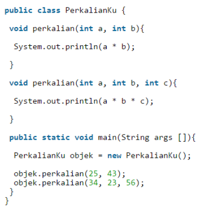
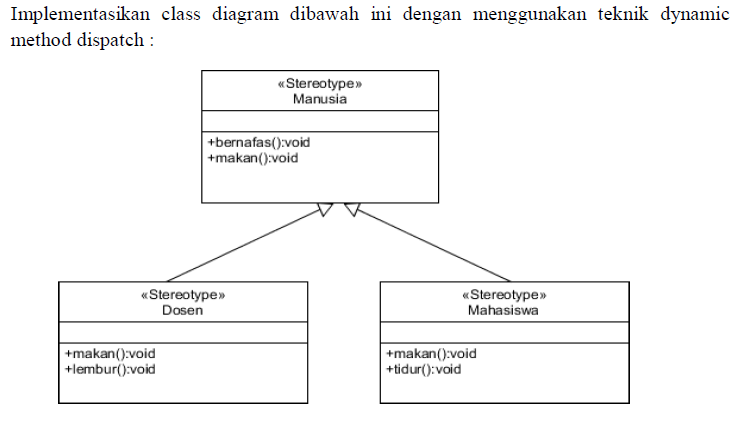
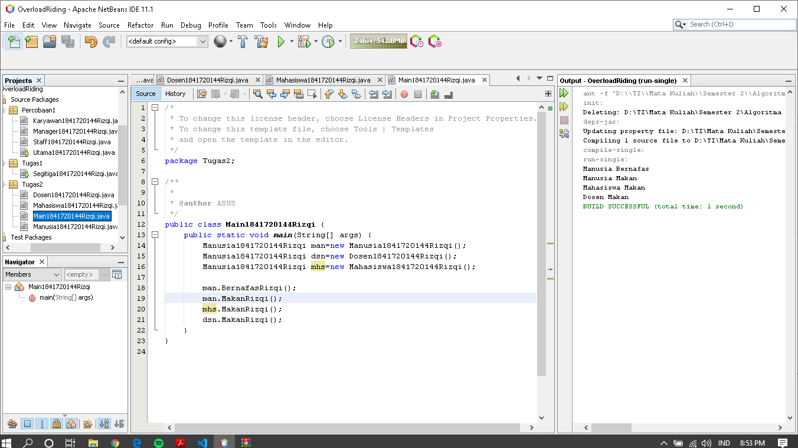

# Laporan Praktikum #7 - OVERLOADING DAN OVERRIDING

## Kompetensi
Setelah menempuh pokok bahasan ini, mahasiswa mampu:  
1. Memahami konsep overloading dan overriding,
2. Memahami perbedaan overloading dan overriding,
3. Ketepatan dalam mengidentifikasi method overriding dan overloading
4. Ketepatan dalam mempraktekkan instruksi pada jobsheet
5. Mengimplementasikan method overloading dan overriding.
***
## Ringkasan Materi
1. Overload
2. Override
***
## Percobaan
>  
>
>  
>
>  
>
>  
>
>[Kode program Percobaan 1 Karyawan1841720144Rizqi.java](../../src/7_Overriding_dan_Overloading/Percobaan1/Karyawan1841720144Rizqi.java)  
>
>[Kode program Percobaan 1 Manager1841720144Rizqi.java](../../src/7_Overriding_dan_Overloading/Percobaan1/Manager1841720144Rizqi.java)  
>
>[Kode program Percobaan 1 Staff1841720144Rizqi.java](../../src/7_Overriding_dan_Overloading/Percobaan1/Staff1841720144Rizqi.java)  
>
>[Kode program Percobaan 1 Utama1841720144Rizqi.java](../../src/7_Overriding_dan_Overloading/Percobaan1/Utama1841720144Rizqi.java)  

***
## Latihan
  
1. Dari source coding diatas terletak dimanakah overloading?  
`Jawab`  
  
2. Jika terdapat overloading ada berapa tipe parameter yang berbeda?  
`Jawab`  
2 paramater dari int diubah menjadi double.jadi parameter yang berbeda ada 2.

 
1. Dari source coding diatas terletak dimanakah overriding?  
`Jawab`  
>
2. Jabarkanlah apabila sourcoding diatas jika terdapat overriding?  
`Jawab`
>method swim dimiliki kelas ikan (Parent)dan kelas ikan piranha(child) mengganti output yang lebih spesifik yaitu ikan piranha bisa makan daging.

***
## Tugas
1. Overloading
 
`Hasil`  
>
>
>[Kode program Tugas 1 Segitiga1841720144Rizqi.java](../../src/7_Overriding_dan_Overloading/Tugas1/Segitiga1841720144Rizqi.java)   

***
2. Overriding
 
`Hasil`  
>
>
>
>
>
>
>
>
>
>[Kode program Tugas 2 Manusia1841720144Rizqi.java](../../src/7_Overriding_dan_Overloading/Tugas2/Manusia1841720144Rizqi.java)    
>[Kode program Tugas 2 Mahasiswa1841720144Rizqi.java](../../src/7_Overriding_dan_Overloading/Tugas2/Mahasiswa1841720144Rizqi.java)    
>[Kode program Tugas 2 Dosen1841720144Rizqi.java](../../src/7_Overriding_dan_Overloading/Tugas2/Dosen1841720144Rizqi.java)    
>[Kode program Tugas 2 Main1841720144Rizqi.java](../../src/7_Overriding_dan_Overloading/Tugas2/Main1841720144Rizqi.java)    

***
## Kesimpulan

1. Mengimplementasikan Overloading
2. Mengimplementasikan Overriding
***

## Pernyataan Diri

Saya menyatakan isi tugas, kode program, dan laporan praktikum ini dibuat oleh saya sendiri. Saya tidak melakukan plagiasi, kecurangan, menyalin/menggandakan milik orang lain.

Jika saya melakukan plagiasi, kecurangan, atau melanggar hak kekayaan intelektual, saya siap untuk mendapat sanksi atau hukuman sesuai peraturan perundang-undangan yang berlaku.

Ttd,

***(Muhammad Rizqi Mahendra)***

