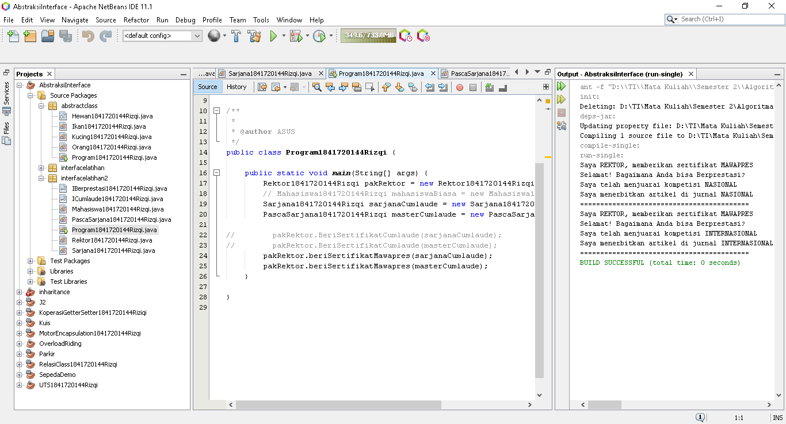

# Laporan Praktikum #9 - Abstract Class dan Interface

## Kompetensi
Setelah menyelesaikan lembar kerja ini mahasiswa diharapkan mampu:
1. Menjelaskan maksud dan tujuan penggunaan Abstract Class;
2. Menjelaskan maksud dan tujuan penggunaan Interface;
3. Menerapkan Abstract Class dan Interface di dalam pembuatan program.
***
## Ringkasan Materi
* Abstract Class
* Interface
* Multiple Interfaces
***
## PERCOBAAN
### PERCOBAAN 1 - Abstract Class
>  
>[Kode program Percobaan 1 Hewan1841720144Rizqi.java](../../src/9_Abstract_Class_dan_Interface/percobaan1/Hewan1841720144Rizqi.java)  
>
>[Kode program Percobaan 1 Ikan1841720144Rizqi.java](../../src/9_Abstract_Class_dan_Interface/percobaan1/Ikan1841720144Rizqi.java)  
>
>[Kode program Percobaan 1 Kucing1841720144Rizqi.java](../../src/9_Abstract_Class_dan_Interface/percobaan1/Kucing1841720144Rizqi.java)  
>
>[Kode program Percobaan 1 Orang1841720144Rizqi.java](../../src/9_Abstract_Class_dan_Interface/percobaan1/Orang1841720144Rizqi.java)  
>
>[Kode program Percobaan 1 Program1841720144Rizqi.java](../../src/9_Abstract_Class_dan_Interface/percobaan1/Program1841720144Rizqi.java)  
>
***
Bolehkah apabila sebuah class yang meng-extend suatu abstract class tidak mengimplementasikan method abstract yang ada di class induknya? Buktikan!  

`Jawab`  
>Tidak, karena abstrak class harus di implementasikan dengan cara override.
>  
>Jadi metode Lulus tidak diimplementasikan sehingga abstrak class error
***
### PERCOBAAN 2 - Interface
>  
>[Kode program Percobaan 2 ICumlaude1841720144Rizqi.java](../../src/9_Abstract_Class_dan_Interface/percobaan2/ICumlaude1841720144Rizqi.java)  
>
>[Kode program Percobaan 2 Mahasiswa1841720144Rizqi.java](../../src/9_Abstract_Class_dan_Interface/percobaan2/Mahasiswa1841720144Rizqi.java)  
>
>[Kode program Percobaan 2 PascaSarjana1841720144Rizqi.java](../../src/9_Abstract_Class_dan_Interface/percobaan2/PascaSarjana1841720144Rizqi.java)  
>
>[Kode program Percobaan 2 Program1841720144Rizqi.java](../../src/9_Abstract_Class_dan_Interface/percobaan2/Program1841720144Rizqi.java)  
>
>[Kode program Percobaan 2 Rektor1841720144Rizqi.java](../../src/9_Abstract_Class_dan_Interface/percobaan2/Rektor1841720144Rizqi.java)  
>
>[Kode program Percobaan 2 Sarjana1841720144Rizqi.java](../../src/9_Abstract_Class_dan_Interface/percobaan2/Sarjana1841720144Rizqi.java)  
>

>Pertanyaan diskusi:
* Mengapa pada langkah nomor 9 terjadi error? Jelaskan!  
`Jawab`  
Karena Mahasiswa biasa Tidak memenuhi syarat yang telah untuk mendapat sertifikat cumlaude.  

* Dapatkah method kuliahDiKampus() dipanggil dari objek sarjanaCumlaude di class Program? Mengapa demikian?  
`Jawab`  
Bisa, Karena dipanggil secara manual
>  

* Dapatkah method kuliahDiKampus() dipanggil dari parameter mahasiswa di method beriSertifikatCumlaude() pada class Rektor? Mengapa demikian?  
`Jawab`  
Bisa, Dengan cara menambahkan abstrak class kuliah dikampus dan di override pada class sarjana dan pascasarjana.  

* Modifikasilah method beriSertifikatCumlaude() pada class Rektor agar hasil eksekusi class Rektor agar hasil eksekusi class Program menjadi seperti berikut ini:
>

`Jawab`   
>

***

### PERCOBAAN 3 - Multiple Interfaces Implementation
>
>
>[Kode program Percobaan 3 ICumlaude1841720144Rizqi.java](../../src/9_Abstract_Class_dan_Interface/percobaan3/ICumlaude1841720144Rizqi.java)  
>
>[Kode program Percobaan 3 Mahasiswa1841720144Rizqi.java](../../src/9_Abstract_Class_dan_Interface/percobaan3/Mahasiswa1841720144Rizqi.java)  
>
>[Kode program Percobaan 3 PascaSarjana1841720144Rizqi.java](../../src/9_Abstract_Class_dan_Interface/percobaan3/PascaSarjana1841720144Rizqi.java)  
>
>[Kode program Percobaan 3 Program1841720144Rizqi.java](../../src/9_Abstract_Class_dan_Interface/percobaan3/Program1841720144Rizqi.java)  
>
>[Kode program Percobaan 3 Rektor1841720144Rizqi.java](../../src/9_Abstract_Class_dan_Interface/percobaan3/Rektor1841720144Rizqi.java)  
>
>[Kode program Percobaan 3 Sarjana1841720144Rizqi.java](../../src/9_Abstract_Class_dan_Interface/percobaan3/Sarjana1841720144Rizqi.java)  
>
>[Kode program Percobaan 3 IBerprestasi1841720144Rizqi.java](../../src/9_Abstract_Class_dan_Interface/percobaan3/IBerprestasi1841720144Rizqi.java)  
>

* Apabila Sarjana Berprestasi harus menjuarai kompetisi NASIONAL dan menerbitkan artikel di jurnal NASIONAL, maka modifikasilah class-class yang terkait pada aplikasi Anda agar di class Program objek pakRektor dapat memberikan sertifikat mawapres pada objek sarjanaCumlaude.  
`Jawab`  
pada class sarjana dilakunan implementasi abstraksi dengan cara override.
>

***
## Kesimpulan

1. Melakukan Implementasi interface
2. Melakukan implementasi class Abstraksi
3. Melakukan Implementasi Multiple Interfaces Implementation

***
## Pernyataan Diri

Saya menyatakan isi tugas, kode program, dan laporan praktikum ini dibuat oleh saya sendiri. Saya tidak melakukan plagiasi, kecurangan, menyalin/menggandakan milik orang lain.

Jika saya melakukan plagiasi, kecurangan, atau melanggar hak kekayaan intelektual, saya siap untuk mendapat sanksi atau hukuman sesuai peraturan perundang-undangan yang berlaku.

Ttd,

***(Muhammad Rizqi Mahendra)***

